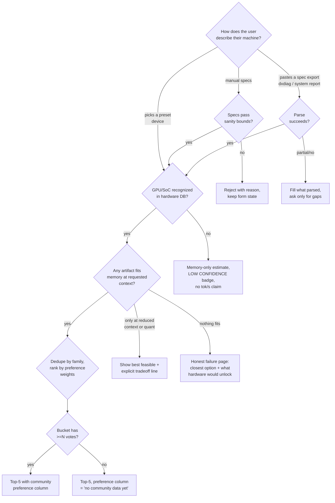
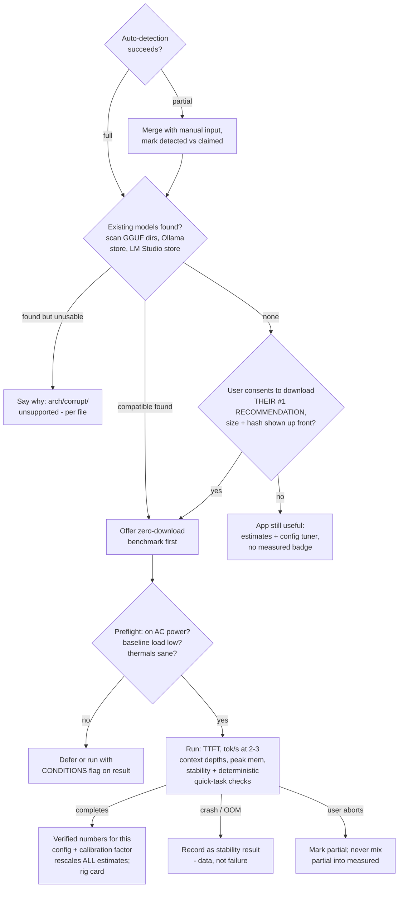
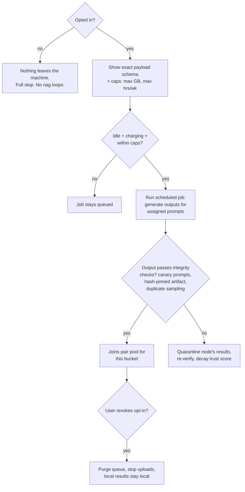
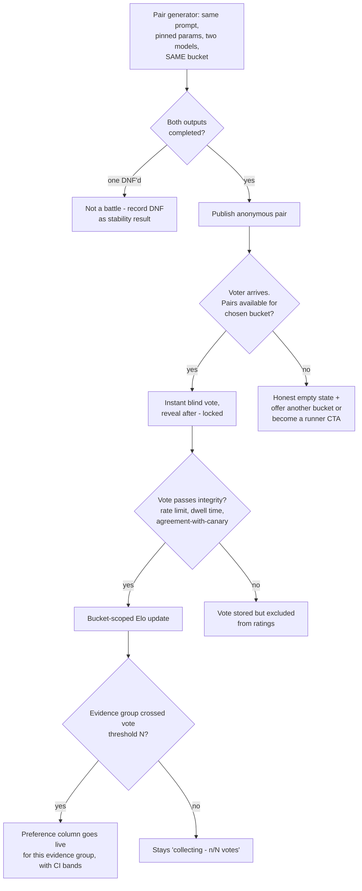
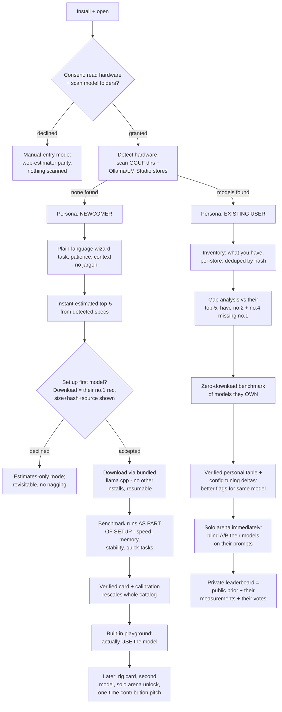
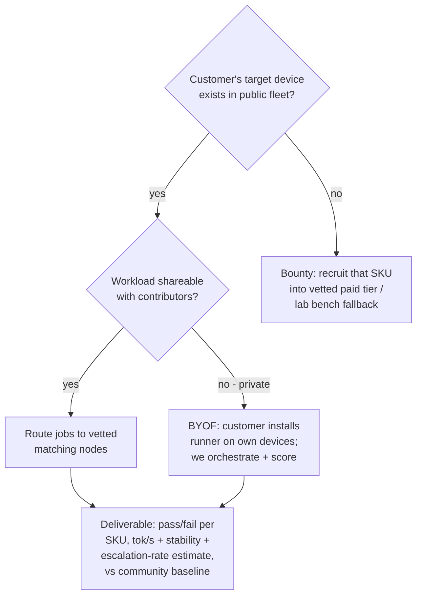

# LocalArcade Decision Tree

This is a **maintained artifact**, not documentation-after-the-fact. Rules:

1. Every branch node has an ID (`A1`, `B3`…). Code that implements a branch references the ID in a comment.
2. Every leaf is a **defined outcome** — including the honest-failure outcomes. "Unhandled" is not a leaf.
3. Every node lists its edge cases and the test that pins them. CI runs an exhaustiveness suite: every enumerable state below must map to a rendered UI state or a recorded result. A new branch without a test fails review.
4. Every number shown to a user follows
   [evidence-evaluation-contract.md](evidence-evaluation-contract.md): metric,
   method, source, hardware match, configuration match, uncertainty, and exact
   identity are independent fields. `estimated`, `measured`, `community`,
   `verified`, and `preference` are derived display claims, never the stored
   evidence model. A bare number is a type error. When evidence cannot support
   an ordering, the output is an **unranked compatible shortlist** — "these
   fit; we can't yet say which is better" — not a manufactured ranking.

## Conditions this tree encodes

| ID | Condition (from product owner) |
|----|----|
| C1 | No unbacked claims. Front-page recommendations must have visible backing (fit math, sourced priors). |
| C2 | Day-1 value with zero users: rough top-5 immediately from hardware input alone. |
| C3 | The 5-minute benchmark upgrades speed/fit numbers from estimated → measured. It never manufactures quality claims. |
| C4 | llama.cpp is the canonical runtime. Ollama / LM Studio are **detection sources only** (find models people already have), never dependencies. |
| C5 | No signup required. No telemetry by default. Contribution is explicit opt-in with visible payload. |
| C6 | Top-5 is five different model families. Best config (quant/context/runtime flags) is chosen *within* each card — never "same model × 3 configs." |
| C7 | Human preference votes are core. Response preference pools by exact configuration + task; experience preference is scoped by hardware evidence. Missing data is shown, never faked. |
| C8 | Voting must be instant: voters judge **pre-generated** outputs; inference never sits in the voting path. |
| C9 | Each decision node below names its owning module so any branch can be found and changed in one place. |

Buckets are defined by **accelerator class × memory tier** (e.g. `apple-silicon/16GB`, `nvidia-dgpu/8-12GB`, `cpu-only/32GB`), not FLOPS: memory capacity/bandwidth is what actually separates local-inference experiences, and named tiers are legible. Two refinements:

- **Display buckets ≠ evidence buckets.** Named tiers are the *display* layer. Underneath, evidence lookup uses **hierarchical matching**: exact configuration → same GPU + runtime/backend → same architecture + memory band → calibrated performance neighborhood → catalog-only estimate. Every shown number states which level supplied it, and exact matches weigh more. This prevents both bucket fragmentation (every exact bucket has 3 observations) and false precision.
- **Runner-detected devices are bucketed by measured behavior**, not marketing specs: a tiny standardized calibration run (memory bandwidth, prompt throughput, generation throughput, offload penalty) assigns the machine to a performance neighborhood. Web-only users pick a coarse tier, labeled "estimated from self-reported hardware." Users never hand-pick their evidence bucket.

---

## Tree A — Web estimator (no install, no account) — C2, C1

Owning modules: `lib/hardware` (A1–A3), `lib/fit` + `lib/rank` (A4–A6), `app/` (leaves).

### A1 — Hardware input method
| Edge case | Outcome | Test |
|---|---|---|
| Visitor on phone/tablet | Estimator works (it's about the machine they *describe*, not the one they browse on); note that the desktop app needs a desktop | e2e: mobile viewport renders full flow |
| User doesn't know their GPU | Preset picker by device name ("MacBook Air M2 16GB", "gaming laptop w/ RTX 4060") maps to specs | unit: every preset resolves to a complete spec |
| eGPU / multi-GPU | v1: single strongest device, banner "multi-GPU not yet modeled" — a stated limitation, not silence (C1) | golden file |

### A2 — Sanity bounds
8 TB RAM, 3 MB VRAM, VRAM > system RAM on iGPU: reject with the specific violated bound, never clamp silently (silent clamping = unbacked output, violates C1). Property test: no accepted input produces a fit computation that exceeds physical memory.

### A4 — Unknown accelerator
The DB will never cover everything. Fallback: fit math still runs (memory is user-supplied); throughput shows as a range with `LOW CONFIDENCE` and **no** single tok/s number. Optionally log the unknown device string (with consent) to grow the DB. Test: golden file for an unknown-GPU input asserts no tok/s point-estimate appears.

### A5 — Nothing fits
This is a *first-class page*, not an error: show the least-demanding viable artifact, what context it allows, and the cheapest hardware change that unlocks a real recommendation. Empty-state e2e suite covers it.

### A6/A7 — Ranking
- Contradictory preferences (max quality + 128K context on 8 GB): never silently drop a constraint — show best feasible and one sentence naming the binding constraint (C1).
- Preference weights live in `lib/rank/weights.ts`; one scorer per file in `lib/rank/scorers/` (C9). Weights are named strategies ("quality", "fastest", "longest context", "lightest") — a strategy whose unit is undefined stays unimplemented rather than vaguely defined. Candidate unit for a future "cheapest": **time + energy per completed task** (community thinking has shifted from cost-per-token to cost-per-task; both terms are measurable from the quick-task suite plus power sampling), implementable only once measured.
- **Per-task frontier-parity honesty:** task-fit priors carry an explicit "vs. frontier" band per task family. Local models are genuinely competitive on extraction/summarization/short chat and genuinely behind on repo-level coding — the recommender must say so rather than overselling, or it loses exactly the users who test it on coding first.
- Tie or near-tie between families: show both, say they're within noise — don't manufacture false precision.
- **A6X — evidence can't support ordering:** when candidates fit but comparative evidence is insufficient, emit the unranked compatible shortlist, never a fake order. This is a distinct leaf with its own UI state and golden file.
- **Role-labeled top-5:** beyond family dedupe, each slot states *why it's there* — best predicted quality / best balanced / fastest practical / best long-context / most conservative-stable. Roles make five slots five genuinely different decisions, and make it structurally impossible for near-identical configs to fill the list. Alternative quantizations/runtimes of the same family nest inside the card.
- **Gap demand signal:** any configuration or bucket without evidence gets a one-click "request this configuration" — the queue of requests decides what the backbone fleet benchmarks next. Cold-start prioritization becomes user-driven instead of guessed.

### What the estimator page shows per card (and what it refuses to show)
Shown: model family + recommended quant, fits ✓/✗ with the math expandable, estimated tok/s **range** with source link, max feasible context, download size, license, copy-paste `llama.cpp` command. Refused: TTFT point-estimates, stability, thermal behavior, any `measured` badge — those belong to Tree B, because the website only knows about hardware *like* yours.

**Optional middle tier — "point us at your llama-server":** a user already running `llama-server` (OpenAI-compatible, localhost) can let the web page run the quick-task suite against it directly from *their own browser* — no install, deterministic scoring client-side, results earn a `measured` badge for speed/task numbers (hardware still self-reported, so no `verified`). Pattern proven by browser-run benchmarks (DuckDB-WASM style); localhost CORS constraints apply and the page must degrade gracefully when the endpoint is unreachable.

---

## Tree B — Desktop app: detect → benchmark → measured truth — C3, C4

Owning modules: `worker/detect`, `worker/bench`, `lib/bench`.

Runtime substrate: the app **bundles a pinned llama.cpp build** (canonical benchmark runtime — no install/compile step, reproducible results keyed to artifact sha256 + build + backend + settings). **MLX is the second canonical engine on Apple Silicon.** Ollama/LM Studio remain detection adapters; their results are recorded but tagged by runtime and never silently merged with canonical-runtime results — runtime is part of the tested configuration.

**Network is a first-class state axis, not an edge case:** every download/upload decision branches on `unmetered / metered / offline`, and offline mode still yields the full estimate experience. Time promises never include download time ("~5 minutes *after* the download"), and any download states its size before consent.

### Edge cases
| Node | Edge case | Outcome |
|---|---|---|
| B1 | Detected hardware ≠ what user claimed on web | Trust detection; show the diff ("you said 16 GB, we found 8 GB usable") |
| B2 | Ollama store found but Ollama's blob format lacks a plain GGUF path | Read via manifest; if unreadable, treat as "found but unusable" with reason — never shell out to Ollama itself (C4) |
| B2Y | Metered/slow connection | Download is resumable, hash-verified, size stated before consent (C5) |
| B4 | Thermal throttle mid-run | Result flagged `throttled`; offer cooled re-run; flagged runs never overwrite clean measured values |
| B5X | Crash on this hardware | Uploaded (if opted in) as a DNF stability datapoint — for the community this is one of the most valuable signals |
| B6 | Measured wildly contradicts estimate (>2× off) | Both shown + flag to review the prior's source row — this is the feedback loop that fixes `lib/priors` |

Two mechanisms make one benchmark worth more than one data point:

- **Calibration transfer:** the measured run yields a machine adjustment factor against the bucket median for the same artifact (e.g. you measured 47 tok/s where the bucket median is 52 → factor 0.90). That factor rescales the *estimated* tok/s of every other candidate in the catalog for this machine — still labeled `estimated`, but now machine-adjusted with narrower ranges. Only the actually-run configuration earns `verified`. Caveat encoded as a rule: small models are compute-bound where large models are bandwidth-bound, so the factor is computed per size/architecture band, never globally from a tiny model.
- **Deterministic quick-task checks:** alongside speed, the run executes ~12–20 short tasks with mechanically checkable outcomes (JSON validates against schema, unit test passes, required facts preserved, format constraints obeyed). This is a real *measured* signal — but it is displayed as "quick task check: 11/14," never blended into a general quality score. It answers "does this config follow instructions on my machine," not "is this model smart."

Rule (C3): the benchmark upgrades **speed/fit/stability + quick-task** claims only. Perceived-quality columns are untouched by Tree B — they come from external priors or Tree D votes, and the UI badge always says which.

**Safety blockers are a separate axis from routing.** "What should we recommend?" and "is it safe to run right now?" are never the same decision: low storage, hash mismatch, battery, thermal, memory pressure, and active-use conditions each *block execution* without ever changing the recommendation list, and an unknown/future state **fails closed** (no run, clear reason) rather than falling through to a default.

---

## Tree C — Contribution runner (opt-in fleet) — C5

Owning module: `worker/contrib`.

Integrity is a branch, not an afterthought: a fleet you can't trust produces a leaderboard you can't defend (C1). Mechanisms: signed runner builds, artifacts pinned by sha256, a small % of prompts are canaries with known-good outputs, and a sample of jobs is silently duplicated across two nodes in the same bucket and compared.

---

## Tree D — Arena — C7, C8

Owning module: `lib/battles`.

Two loops that never block each other:

**Solo arena (your device only — works day 1, no network):** the Local-LLM-Arena idea, in the desktop app: blind A/B between models *you* have, on *your* prompts, votes stay local unless opted-in. Sequential generation by default — never load two models at once on a memory-constrained machine (the exact mistake that killed the reference project).

**Crowd arena (web, instant).** Two distinct battle types producing two separate scores that are never blended at the data layer:

1. **Response battle** — "which answer is better?" Text-only, latency hidden/normalized so speed can't contaminate the quality signal. Feeds a configuration + task preference model and pools across hardware when inference identity matches.
2. **Experience battle** — "which would you actually rather use?" The voter watches both generations as **recorded trace replays**: the contributor node captured token-timestamps during generation, and the web app replays the authentic cadence (TTFT, stalls, stutter) instantly from storage. This keeps C8 intact — real streaming feel, zero live dependency on nodes being online — and both traces must come from matched machines in the same bucket. Feeds a separate experience-preference score.

The recommendation strategies then draw on the right signal: "highest quality" weighs response preference; "fastest" weighs measured telemetry; "balanced" weighs experience preference + reliability. A fast-but-dumb config can never buy quality rank with speed, and vice versa.

**Own-prompt battles (deferred) — constraints and economy.** Voters judging strangers' prompts don't know the prompter's standard, so own-prompt battles are the highest-value signal — but the fleet is *edge devices*, not a datacenter, so they are rationed and bounded:

- **Job bounds:** single-turn or short-chain generation only, hard token caps, no agent loops on contributor machines. Anything heavier belongs to the enterprise BYOF tier, never the volunteer fleet.
- **Background by design:** submissions join per-bucket batch queues processed in contributors' idle windows; the prompter is told "hours, not minutes" up front and notified when their pair is ready. The wait doubles as the re-engagement loop.
- **Dedup cache first:** new prompts are clustered against already-battled ones; a near-duplicate gets an existing pair *instantly* and costs the fleet nothing. Only genuinely novel prompts consume compute.
- **Credit economy (the incentive answer):** cloud arenas attract prompts by offering access to models people don't subscribe to; LocalArcade has no equivalent free lunch. Instead: judging K curated pairs or contributing compute earns a credit for one own-prompt battle. Voting liquidity funds generation capacity, and the honest draw is real: *see what a local setup — or a bigger machine than yours — would do with your actual prompt, before spending gigabytes or dollars.*

Edge cases: voter picks a bucket that isn't their hardware — allowed (judging text quality doesn't require owning the machine; the *outputs* carry the hardware truth, which is what makes bucket-scoping honest). Both answers bad → "both bad" is a valid vote (Arena-style). A model that never completes in a bucket doesn't silently vanish — it shows as DNF in that bucket's table.

---

## Tree F — First-run journeys (desktop app) — C2, C3, C5

Owning modules: `worker/onboard`, plus everything in Trees B–D. Two personas, one shared spine, forked by the model scan.

| Node | Edge case | Outcome |
|---|---|---|
| F3 | Store found but artifacts unreadable/corrupt | Listed per-file with reason, never silently skipped |
| N3 | Hardware too weak for any good experience | Honest page: least-bad option + expected feel; no upsell theater |
| N4 | Metered/offline network | Defer download, estimates remain fully usable |
| N5 | First benchmark crashes | Framed as a result ("this config doesn't work — trying safer preset"), auto-retry smaller preset once |
| E1 | Same weights present in two stores | Dedupe by sha256, show both locations |
| E3 | Large library | Prioritize by "in your top-5" then recency; never benchmark-all by default |
| E6 | Everything | Private data stays local unless the one-time opt-in is accepted; the pitch appears **after** value is delivered, once |

The two personas answer different first questions — the newcomer's is "what should I get and will it work?", the existing user's is "is what I already have optimal?" — and both reach the same end state: measured personal truth layered over public priors.

## Tree E — Enterprise edge evaluation

Owning module: future `lib/fleet` — see design discussion; branches summarized so consumer trees stay honest about what they feed.

Never route a customer's private prompts to anonymous residential nodes — that branch does not exist.

---

## Source trust policy

External data and code are admitted by tier; the tier travels with anything ingested from it:

- **Tier 1 — build on:** org-backed, many-eyes, or peer-reviewed. llama.cpp, LocalScore (Mozilla Builders — study its protocol, consider importing its opt-in public results as throughput priors, with attribution), HF Hub APIs, MLPerf Client, the Chatbot Arena Bradley–Terry methodology (published paper).
- **Tier 2 — read for patterns, never import numbers:** open code, single-author, few eyes (Local-LLM-Arena, CanIRunThisLLM, sql-benchmark, whatmodels, whichllm, GPU-Poor Arena). Their *mechanisms* can be borrowed after reading the code; their *data* is not evidence.
- **Tier 3 — ideas only:** closed or unverifiable (forwardcompute advisor, uniclaw/OpenClaw, AgentStatus, blog-tier VRAM guides). Nothing is built on these.
- **Community lore is hypothesis, not fact:** claims like "Q4_K_M is king," "KV-cache q8 is a free lunch under 40K context," "MoE beats dense 10× on 16 GB" are exactly what the fleet exists to test. Each becomes a runnable experiment; confirmed results become published findings (and launch content). Lore is never hard-coded into scorers.

## Cold-start seeding (pre-launch)

The backbone fleet doesn't wait for the crowd — before launch it runs the seed pass itself: ~6 flagship buckets (8/12/16/24 GB NVIDIA, Apple Silicon 16–32 GB and 64 GB+), 5–10 popular artifacts each, across 3–4 task families. Result: the flagship buckets launch with genuine `community`-class measured data, not just estimates, and the "request this configuration" queue (A6) decides all coverage growth after that. Enough evidence for a defensible top five in the buckets that matter — exhaustive coverage explicitly not the goal.

## Enforcement layers

The tree is enforced twice, at different altitudes:

1. **This document** — the human layer: node IDs, edge cases, honest-failure leaves. Code references node IDs in comments.
2. **An executable policy module** — the machine layer: the routing decision (hardware state × evidence state × runner state × artifact state × network state) and the separate safety-blocker check are implemented as one pure, fail-closed function that UI, API, and runner all consume. Branching logic is never re-derived inside components; invariant tests pin the contract (no download without artifact-specific consent, no execution without run consent, no `verified` label without exact evidence, no ordering without sufficient evidence, declining the runner never removes recommendations, unknown states fail closed).

## Exhaustiveness enforcement

- `lib/**` decision points are typed state machines; a `switch` over a state enum with a missing arm fails typecheck.
- The empty-state e2e suite boots the app with zero community data and asserts every page renders its designed empty state (A5Y, A7-no, D4X, D8N).
- Golden-file suite in `lib/rank` covers: unknown GPU, nothing-fits, contradictory prefs, tie, dedupe.
- This document and the code cross-reference by node ID; PR checklist item: "new branch → new node here + new test."
