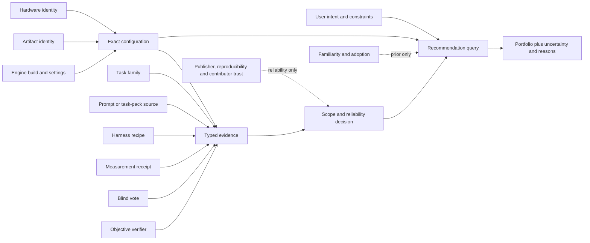
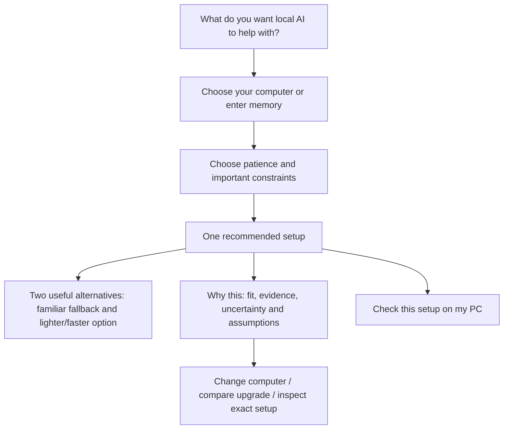
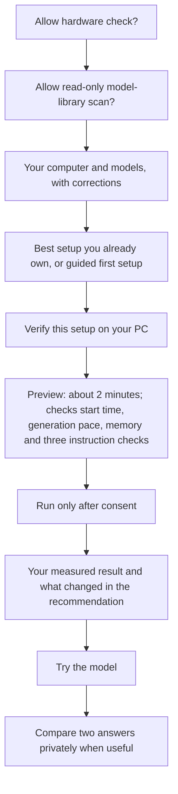
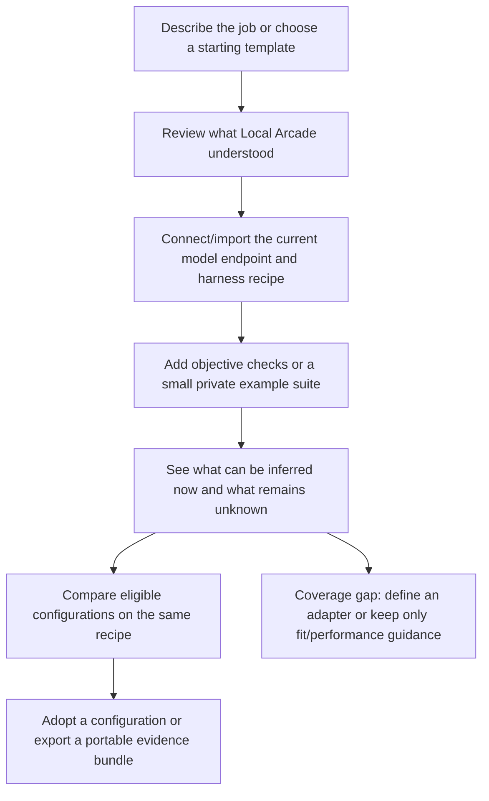

# Local Arcade evidence ranking, prompts, API and UX

Status: design draft. This document changes no product code and authorizes no
data collection, public upload, model training or downstream learning claim.

Related documents:

- [system-operation-graph.md](system-operation-graph.md)
- [modular-architecture-v2.md](modular-architecture-v2.md)
- [recommendation-decision-system.md](recommendation-decision-system.md)
- [ui-reference-and-screen-plan.md](ui-reference-and-screen-plan.md)

## Decisions in one page

1. Local Arcade will not improve on llmfit merely by displaying its component
   scores. It will rank exact configurations through a contextual evidence
   graph with uncertainty, provenance and metric-specific transfer rules.
2. Popularity is not quality. Familiarity and verified adoption can reduce
   cold-start risk, so they are retained as separate priors and never hidden
   inside task-quality evidence.
3. The website may prefer a familiar, well-supported configuration when two
   options are evidentially close. It may not bury a materially better supported
   option merely because it is unfamiliar.
4. Every battle or experiment names its prompt source. No operation consumes an
   unspecified prompt pool and no installed transcript is harvested by default.
5. llmfit has broad use-case labels and configurable regex-role checks. It does
   not model a person's actual coding, RAG, lookup or agent workflow.
6. “Teachability without weight changes” is renamed **harness responsiveness**.
   It is an experimental API evidence type, not a novice-facing score.
7. Local Arcade's API is a recommendation/evidence/configuration API. It is not
   another OpenAI-compatible inference proxy.
8. Novices are never shown a context-free “Run benchmark” action. Verification
   is offered as a concrete step inside setup: what it checks, why, duration,
   machine impact and what will change afterward.
9. A vendor-neutral export may contain an exact configuration plus
   harness-response and evaluation evidence. It does not name a private consumer
   or claim that any downstream system trained or learned from it.
10. Local Arcade does not enumerate every possible workflow. It composes a
    finite set of declared workflow dimensions, preserves custom fields, and
    returns `workflow-coverage-gap` when it cannot evaluate a workflow honestly.

# 1. Ranking beyond llmfit

## 1.1 What llmfit contributes

llmfit supplies useful upstream evidence and mechanisms:

- hardware detection and capacity representation;
- broad model-family knowledge;
- estimated fit, run path and throughput;
- installed-provider discovery;
- local and matched-community throughput;
- broad `General`, `Coding`, `Reasoning`, `Chat`, `Multimodal` and `Embedding`
  use-case categories;
- an embedded task-score prior for `coding`, `reasoning` and `chat`;
- YAML-defined role tests with regex rules, speed and composite outputs.

Local Arcade must not present those as knowledge of a user's real workflow.
There is no llmfit contract for a RAG corpus, retrieval settings, tool API,
repository, agent loop, acceptance test or organization policy.

## 1.2 The Local Arcade evidence graph

A recommendation is contextual. The candidate is not merely a model family; it
is an exact configuration connected to the conditions under which evidence was
created.



This graph permits more than “show four scores”:

- measured performance transfers only across sufficiently matching hardware and
  configuration identity;
- response preference can pool across hardware when the inference identity is
  comparable;
- experience preference remains hardware/configuration scoped;
- task evidence transfers only within declared task/harness scope;
- contradictory evidence remains visible;
- sparse configurations borrow cautiously from related families and hardware,
  with wider uncertainty;
- new evidence updates only the channels it actually observed.

## 1.3 Ranking pipeline

The ranking engine operates in this order:

1. **Hard eligibility:** artifact integrity, license, capability, runtime,
   backend, memory, context and safety constraints.
2. **Evidence admission:** A12 decides which evidence can support which metric
   for this query.
3. **Reliability weighting:** source reproducibility, sample count, recency,
   configuration match, contributor integrity and contradiction history.
4. **Channel estimates:** retain distributions/intervals for fit, speed,
   stability, objective task success, response preference and experience.
5. **Pareto reduction:** remove candidates that are worse or equal on every
   user-relevant channel with no compensating uncertainty advantage.
6. **Contextual utility:** apply the person's stated priorities to the remaining
   channels. Never make speed part of response-quality evidence.
7. **Cold-start prior:** apply the familiarity/trust policy below.
8. **Exploration:** retain an evidence-seeking candidate when expected value or
   uncertainty justifies it.
9. **Explanation:** return component evidence, confidence, assumptions,
   exclusions and the next action that could change the result.

The statistical implementation can start simple—interval-aware weighted rules
and Bradley-Terry preference estimates—and later move to a hierarchical model
or contextual bandit without changing the evidence contracts.

## 1.4 Popularity, familiarity and trust

PageRank was not “the most-mentioned page wins.” It recursively treated links
from important pages as stronger signals of importance. The original Google
paper described link structure as an approximation of importance or quality,
not truth about every query. Raw model downloads have even weaker semantics:
they may reflect release age, hype, bundling, automation or a publisher's reach.

Local Arcade therefore stores three separate cold-start concepts:

| Signal | Meaning | Allowed ranking use |
|---|---|---|
| Raw popularity | Downloads, likes, installs or mentions | Discovery/coverage priority; never quality evidence |
| Familiarity | A person is likely to recognize the family and find help | Small capped tie-break or one familiar portfolio anchor |
| Verified adoption | Repeated exact-config use with successful reproducible receipts | Reliability prior within its observed scope |

Website policy when little is known:

- prefer an exact, supported, familiar option when candidates are within a
  declared equivalence/uncertainty margin;
- include at least one familiar anchor among the portfolio when eligible;
- label an unfamiliar recommendation and state the concrete evidence that
  caused it to outrank the anchor;
- never turn absence of popularity into negative quality evidence;
- never let familiarity override incompatibility, license, integrity or a
  materially stronger scoped result;
- preserve an exploration slot so incumbents do not become unassailable.

Models and results are not inherently hard to game. Benchmark-targeted training,
contaminated task sets, inflated download counters, fabricated community rows
and selective reporting are all possible. Trust comes from reproducibility:
immutable artifacts, hidden/rotating checks where appropriate, signed runner
versions, duplicated jobs, canaries, outlier handling and contributor trust
decay—not from obscurity or popularity alone.

## 1.5 A PageRank-like opportunity

The analogous opportunity is not one universal model score. It is an
**evidence-propagation algorithm** over the graph above:

- exact matches receive direct evidence;
- related configurations receive discounted evidence according to explicit
  transfer rules;
- reliable, independently reproduced measurements carry more weight;
- contributors gain or lose reliability from canaries and duplicate jobs;
- uncertainty increases with every graph distance or identity mismatch;
- a user's private results dominate generic public priors for that same scope;
- the system selects the next comparison that most reduces decision uncertainty.

The potential breakthrough is “which evidence should transfer here, how much,
and what one test would most improve this decision?” That is more specific and
defensible than inventing another global leaderboard.

## 1.6 What the benchmarks are for—and why this is not a router benchmark

Local Arcade does not ask ordinary users to arrive with a database. It uses two
strictly separated evidence sources:

1. **Public screening evidence:** versioned, redistributable task packs and
   consented hardware measurements narrow the set of configurations worth trying.
   They answer compatibility, speed/stability and bounded capability questions.
2. **Optional private confirmation:** a prompt, a few examples, existing tests or
   a local suite can decide whether a screened candidate works for one person's
   recurring job. These inputs remain local by default and are not required for
   the website finder.

This is different from a predictive model router. A router such as Not Diamond
learns which endpoint to call for each incoming prompt, and a custom router needs
representative prompts plus candidate responses and scores. Local Arcade's first
job is earlier in the stack: identify exact local configurations that fit the
hardware, expose how they have behaved under matching conditions, and recommend
the smallest useful local verification. It does not route every prompt.

Hardware-dependent evidence is never placed on one global ladder. Each receipt
pins model artifact, runtime/build, settings, task pack, operating environment and
hardware. The UI first filters to comparable receipts, then shows distributions
inside that scope. Quality/task outcomes may transfer across sufficiently similar
hardware only when the execution path is equivalent; fit, latency, throughput,
load time, energy and stability remain hardware-conditioned. A result from a much
faster GPU can establish that a task passed, but not how responsive it will feel
on the user's machine.

# 2. What L16 and L17 mean

These are audited llmfit operations, not Local Arcade milestones.

| ID | Plain-language operation | Input | Output | Local Arcade use |
|---|---|---|---|---|
| L16 | Benchmark one reachable inference endpoint | endpoint/provider, model, prompts/run settings | throughput, TTFT, timing, tokens and failures | A17 wraps execution with exact configuration identity, preflight and repeatability |
| L17 | Find endpoints/models that could be benchmarked | enabled providers and local runtime state | reachable benchmark targets or diagnostics | A3/A16 use it to offer valid verification targets instead of asking for arbitrary paths |

L17 does not benchmark anything. It answers “what can this machine currently
test?” L16 then tests one selected target. Neither operation establishes general
response quality.

# 3. Prompt and task-pack provenance

## 3.1 Allowed prompt sources

Every `BattlePlanV1`, `MeasurementPlanV1` and `HarnessExperimentPlanV1` contains
one of these sources:

| Source | Used for | Default privacy/publication |
|---|---|---|
| `user-entered-private` | solo A/B on a prompt the person types or explicitly pastes | local only; text not uploaded |
| `user-imported-suite-private` | repeated personal/project evaluation | local only unless fields are explicitly selected later |
| `localarcade-curated-public` | deterministic quick checks and seed battles | public, versioned and redistributable |
| `third-party-licensed-pack` | attributed evaluation where license permits | follows pack license and provenance |
| `server-assigned-public-job` | consented volunteer fleet generation | exact payload preview; only bounded public prompts |
| `user-contributed-public` | prompt voluntarily added to public pair pool | separate preview, license/consent and moderation |
| `user-workflow-private` | user-owned cases used for a bounded private workflow comparison | never sent to the public fleet |

Forbidden sources:

- transcript-folder scan;
- browser/chat history harvesting;
- prompts inferred from installed applications;
- private user-workflow tasks sent to anonymous community hardware;
- a prompt without a source/license/consent state.

## 3.2 Solo battle

“Execute solo battle” means:

1. The person supplies a prompt now, chooses an explicitly imported private
   suite, or chooses a visible curated example.
2. A21 pins the two exact configurations, sampling policy, order and token cap.
3. A22 runs them sequentially by default on the person's device.
4. A23 hides model identity until the vote is committed.
5. The prompt, attempts and vote stay local unless the person later constructs
   a contribution preview.

It never means silently replaying their previous conversations.

## 3.3 Public measurement and pair intake

A26 validates records produced from `localarcade-curated-public`, an admitted
licensed pack, or a consented `server-assigned-public-job`. It checks prompt-pack
revision, artifact/configuration identity, completion, duplication/canaries,
content policy and contribution receipt.

The public system should begin with a small task ontology:

- instruction/format following;
- structured extraction;
- factual transformation/summarization with supplied source;
- deterministic reasoning;
- code generation with an executable checker;
- tool-call selection/arguments with a fixed tool schema;
- retrieval-grounded answering only when corpus, retriever, chunking and
  citation checker are pinned.

`coding`, `RAG` or `agent` alone is not a reproducible bucket. A workflow bucket
must identify its harness and evaluator—for example:

```json
{
  "taskFamily": "retrieval-grounded-answering",
  "taskPackRevision": "...",
  "harnessRecipeId": "rag-fixed-v1",
  "retriever": "...",
  "chunkingRevision": "...",
  "toolSchemaRevision": null,
  "evaluatorRevision": "citation-support-v1"
}
```

This does **not** require Local Arcade to enumerate every possible workflow.
There are effectively unlimited user workflows. Use three layers instead:

1. A **seed lane** such as coding, writing, retrieval or extraction helps browse
   candidates and choose public task packs. It is a weak prior, never a quality
   certification.
2. A **user-owned workflow** names a repeated real job such as “answer invoice
   questions against our ERP export” or “debug this repository with pytest.” It
   may be described gradually through stable facets: client/app, project or data
   source, tools, output contract, verifier, risk and interaction style.
3. A **reproducible evaluation scope** pins only the facets needed to make one
   comparison valid: task pack/cases, harness recipe, evaluator and exact model
   configuration.

Unknown is a valid state. Local Arcade may give broad fit/setup guidance from a
seed lane while saying that workflow quality is untested. A specialist can
explicitly name/import a workflow or export the exact candidate configuration to
a private evaluator. That evaluator must qualify it on the person's own workflow
evidence. No model is required to magically classify every possible job.

## 3.4 Infinite workflows without magic

There are effectively infinite workflows. Local Arcade must not maintain one
hard-coded bucket for each. It uses three layers:

1. **Intent:** what the person is trying to accomplish in their own words.
2. **Workflow primitives:** a finite, extensible description of inputs, outputs,
   grounding, tools, state, risk and evaluation.
3. **Recipe:** the exact executable harness and evaluator used for evidence.

`WorkflowIntentV1` contains:

```json
{
  "workflowId": "workflow_...",
  "name": "Check supplier invoices before payment",
  "intentText": "Extract invoice fields and flag totals that do not reconcile",
  "input": {
    "modalities": ["pdf", "image", "text"],
    "typicalBytes": 2500000,
    "sensitivity": "business-confidential"
  },
  "grounding": {
    "kind": "provided-documents",
    "retrievalRequired": false,
    "citationsRequired": true
  },
  "tools": ["ocr", "calculator", "vendor-lookup"],
  "interaction": {
    "turns": "single-or-short",
    "latencyPriority": "normal",
    "humanReview": "required"
  },
  "output": {
    "kind": "json-schema",
    "schemaRevision": "invoice-check-v1"
  },
  "evaluation": {
    "objectiveCriteria": ["schema-valid", "totals-reconcile", "citations-supported"],
    "preferenceCriteria": ["clear-review-notes"],
    "risk": "financial-review"
  },
  "custom": {}
}
```

Finite primitives currently include:

- input modality, size, sensitivity and typical context;
- output form/schema and required citations;
- supplied-context, retrieval-grounded or open-world grounding;
- tool schemas and tool-result format;
- single-turn, conversational or bounded agentic interaction;
- latency, throughput and offline requirements;
- deterministic/objective criteria and subjective preference criteria;
- consequence/risk and required human review;
- custom extension fields retained but not interpreted without a registered
  adapter.

Examples become compositions rather than magic categories:

| Person's description | Primitive composition | Evidence that can transfer |
|---|---|---|
| “Basic questions” | text → conversational text; no required grounding/tools | general chat priors plus private preference evidence |
| “Code in my repository” | repo context + language + tools/tests + patch output | only matching language/tool/evaluator evidence; repo suite remains private |
| “Answer from my documents” | retrieval-grounded + corpus/retriever/chunking + citations | RAG evidence only for matching recipe layers; broad model priors otherwise |
| “Check invoices” | document/OCR + structured extraction + calculator + schema + human review | extraction/schema/arithmetic primitives; exact invoice suite for final ordering |

The compiler may suggest a template, but it returns its derivation and asks the
person to confirm material assumptions. Unsupported custom behavior produces:

```json
{
  "status": "workflow-coverage-gap",
  "understood": ["pdf-input", "json-schema-output", "calculator-tool"],
  "unknown": ["custom-vendor-policy-v3"],
  "usableEvidence": ["fit", "speed", "structured-extraction-prior"],
  "withheldClaims": ["workflow-quality-rank"],
  "nextActions": ["import-private-evaluation-cases", "define-evaluator-adapter"]
}
```

That is the non-magical rule: Local Arcade can recommend for the dimensions it
understands and must withhold workflow-specific quality claims for the rest.

# 4. Harness responsiveness, not teachability

Local Arcade does not change weights in the current scope. “Teachability” would
mislead users into expecting fine-tuning evidence. The current experimental
metric is **harness responsiveness**: how much a fixed model configuration's
held-out performance changes under bounded, reproducible non-weight recipes.

## 4.1 Recipe dimensions

- system/developer instruction structure;
- chat template and role formatting;
- few-shot examples;
- output schema or grammar;
- tool schema and tool-result formatting;
- retrieval corpus/retriever/chunking/prompt insertion;
- context selection/compression policy;
- bounded critique/retry/scaffold policy;
- sampling settings where the experiment explicitly includes them.

## 4.2 Metrics

| Metric | Definition |
|---|---|
| Baseline score | Objective or preference evidence under the declared default recipe |
| Best validated lift | Held-out improvement of an admitted recipe over baseline |
| Median lift | Robust center across task templates, not the single best task |
| Regression rate | Fraction of held-out criteria that become worse |
| Transfer | Lift retained on held-out templates/subfamilies |
| Stability | Variance across seeds/repetitions and small recipe perturbations |
| Added cost | Extra input/output tokens, latency, memory and tool calls |
| Recipe complexity | Steps, external dependencies and state required |
| Sensitivity | How sharply results change with small recipe changes |
| Confidence | Interval from task/repetition count and evidence quality |

No public UI badge says “teachable.” An experimental API may return:

```json
{
  "schemaVersion": 1,
  "status": "experimental",
  "kind": "harness-responsiveness",
  "configurationId": "config_...",
  "taskPackRevision": "...",
  "baselineRecipeId": "recipe_default_...",
  "candidateRecipeIds": ["recipe_schema_...", "recipe_examples_..."],
  "bestValidatedLift": 0.14,
  "medianLift": 0.08,
  "regressionRate": 0.04,
  "addedInputTokensMedian": 620,
  "addedLatencyMsMedian": 180,
  "stability": {"repetitions": 5, "standardDeviation": 0.03},
  "confidence": {"low": 0.04, "high": 0.12},
  "claimBoundary": "No weight adaptation was performed."
}
```

This is primarily for advanced integrations and research—not the finder screen.

# 5. Local Arcade API

LM Studio has native REST, Python and TypeScript APIs in addition to OpenAI- and
Anthropic-compatible inference endpoints. Local Arcade also needs an API, but
copying inference compatibility would confuse its responsibility.

Local Arcade consumes inference servers; it does not pretend to be one.

## 5.1 Goal-specific v1 surface

| Endpoint | Purpose | Side effect |
|---|---|---|
| `GET /v1/capabilities` | supported schemas, adapters, evidence and experimental features | none |
| `POST /v1/workflows/compile` | plain-language/template input to reviewable workflow primitives | none |
| `POST /v1/workflows` | save a confirmed local/hosted workflow definition | explicit persistence |
| `POST /v1/workflows/{id}/evaluation-plans` | determine evaluable dimensions, gaps and required cases/adapters | none |
| `POST /v1/recommendations` | exact portfolio for hardware, task and preferences | none |
| `POST /v1/recommendations/explain` | component evidence, exclusions and counterfactual next steps | none |
| `POST /v1/hardware/simulations` | capacity or exact-device what-if | none |
| `POST /v1/hardware/plans` | required resources and mapped exact-device candidates | none |
| `POST /v1/configurations/resolve` | model family/file/provider input to exact admitted configuration | registry read only |
| `POST /v1/measurements/plans` | preflight and human-readable verification plan | none |
| `POST /v1/measurements/runs` | execute locally or create a bounded runner job | explicit execution |
| `POST /v1/battles/plans` | create solo/public comparison plan with prompt source | none |
| `POST /v1/battles/{id}/votes` | commit blind vote | local or explicit public mutation |
| `POST /v1/experiments/harness-responsiveness` | run/submit the experimental recipe comparison | explicit execution |
| `GET /v1/evidence/{id}` | typed evidence and provenance | none |
| `POST /v1/exports/evidence-bundles` | construct a previewable vendor-neutral interchange package | no upload by itself |

Every mutating request uses an idempotency key, returns a preview/plan before
execution where practical, and returns a receipt afterward. Hosted website and
desktop-local implementations share schemas but advertise different
capabilities. The website never claims it detected or measured a visitor's PC.

## 5.2 Problems in upstream surfaces that Local Arcade avoids

- Do not expose broad model selectors where an immutable configuration is
  required.
- Do not mix formula estimates, local measurements and community medians in one
  unexplained number.
- Do not blend speed and response quality into one upstream composite.
- Do not make provider discovery implicitly authorize execution or deletion.
- Do not treat a matching GPU name as full configuration identity.
- Do not require API consumers to understand llmfit's Rust structs or UI terms.
- Do not use an inference-compatible endpoint for recommendation semantics.

# 6. Portable evidence export

Local Arcade's public surface does not name or expose a private downstream
product. It exports a vendor-neutral, previewable package. Another local tool,
private service or evaluation system may import that package, but must qualify
the candidate independently against its own workflows.

## 6.1 Useful package

`ConfigurationEvidenceBundleV1` may include:

- exact artifact and runtime configuration identity;
- hardware/runtime capability envelope;
- task-pack and harness-recipe identities;
- objective results and failure modes;
- response/experience preference evidence where consent permits;
- harness-responsiveness profile;
- latency/cost/context trade-offs;
- evidence provenance, confidence and claim boundaries;
- recommended public-anchor or quick-check cases;
- no raw private prompt/output unless separately selected.

A downstream consumer can use this to:

- add an exact candidate beside the user's incumbent;
- map it to an explicit user-owned workflow or leave it as a broad unverified
  candidate;
- run bounded comparisons/auditions on the user's own cases;
- decide whether a cheaper harness recipe closes a criterion-specific gap before
  any weight experiment;
- seed reproducible public-anchor and quick-check evidence without calling it
  personalized proof;
- preserve context, timeout, tool and runtime requirements;
- rerun grounded personal regression cases after model/configuration changes;
- compare potential savings with experiment overhead honestly.

Imported Local Arcade evidence retains its original source and scope. It never
becomes verified personal workflow evidence merely because it was imported. The
receiving system must earn that conclusion on distinct interactions inside the
user's workflow. Harness experiments remain gated and reversible; weight
adaptation remains a separate concern.

## 6.2 Collection disclosure

“We are experimenting to see if this can inform results” is too vague as a data
notice. The experimental feature can be hidden from the main finder, but the
person must still see:

- what will run;
- which fields remain local;
- which fields would be uploaded;
- the destination and purpose;
- whether prompts/outputs are included;
- duration/resource caps;
- how to decline or revoke.

The product may collect local experimental evidence without displaying a
consumer score, but it may not secretly upload it.

# 7. Novice UX plan

The simple journey is one entry path, not the whole product. Local Arcade has
four user intents sharing the same contracts:

| Entry intent | First question | Primary surface |
|---|---|---|
| New to local AI | “What should I try on this computer?” | short finder |
| Existing local-model user | “Is what I own configured well?” | inventory and verification |
| Workflow owner | “What works best for this RAG/coding/invoice process?” | workflow workspace and private eval |
| API/power user | “How do I automate recommendations and evidence?” | versioned API and receipts |

## 7.1 Website journey



The first result page does not show four raw scores. It shows:

- one answer;
- a short reason tied to the person's request;
- confidence/evidence language;
- one familiar fallback where eligible;
- one action to change an assumption;
- one desktop handoff to verify locally.

Detailed channels and provenance are available under “Why this?” for advanced
users and API consumers.

## 7.2 Desktop journey



Replace “Run benchmark” with an outcome-specific action:

- **Check how this setup runs on my PC**
- **Verify the model I already have**
- **Compare the safe and fast settings**
- **See whether the upgrade would matter**

The preview states purpose, duration, system load, exact target and resulting
decision. Verification is part of setup, not a top-level benchmark laboratory.

llama-swap does not solve this consumer problem. It provides a playground,
metrics and logs for people who already chose and configured their models. The
broader analogies are first-run game auto-configuration and Steam Deck's visible
compatibility details: users receive an expected outcome, can inspect caveats,
and verify through normal use rather than confronting an unexplained test suite.

## 7.3 UX verdict on the current Local Arcade prototype

The current code proves pieces of hardware entry, recommendation policy,
scanning and execution, but the existing persona findings already show that the
journey is not release-intuitive:

- newcomers encounter concepts and requirements they cannot satisfy;
- missing evidence can look like weak hardware;
- model scans can produce unresolved artifacts without a useful recovery path;
- the benchmark action exposes implementation machinery before explaining the
  outcome;
- no coherent finder-to-exact-setup-to-verification-to-use sequence owns the
  whole user problem.

The flows above must be approved as screen/state documentation before UI
implementation resumes.

## 7.4 Workflow-owner journey



This journey exposes task packs, recipes and evaluators because this person has
a concrete workflow. The novice finder does not.

# 8. Design acceptance tests

The design is ready to implement only when fixtures can prove:

1. A popular model cannot override incompatibility or materially stronger
   scoped evidence.
2. A familiar anchor appears when evidence is sparse and the candidate is
   eligible.
3. An obscure winner includes a concrete evidence explanation.
4. No battle plan validates without an allowed prompt source.
5. No RAG result pools across different corpus/retriever/chunking/evaluator
   identities.
6. L17 discovery never authorizes L16 execution.
7. Harness responsiveness always includes baseline, held-out evaluation, cost,
   regressions, confidence and the no-weight-change boundary.
8. A portable evidence bundle contains no raw private prompt/output by default.
9. Website results never claim local detection or measurement.
10. Every execution/upload has a preview, explicit authorization and receipt.
