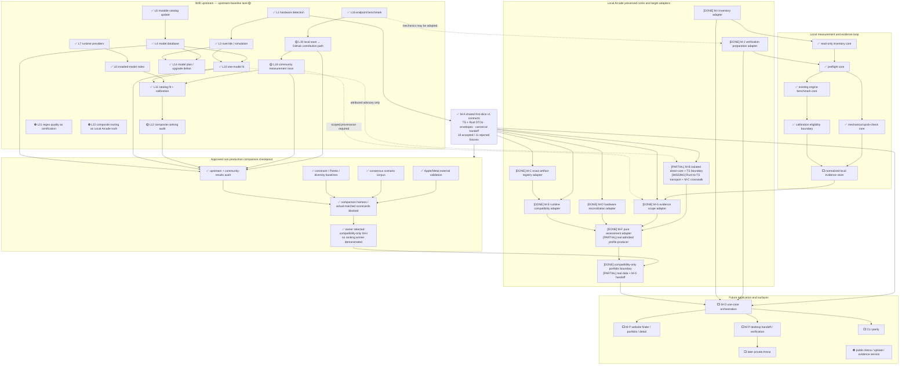

# Ranking research assembler

Status: **Owner review**, 2026-07-22. This document tracks the
owner-approved non-production ranking/audition research. It is an assembler
view, not evidence that future modules are implemented.

Owner-review synthesis: [ranking and audition findings](research/ranking-and-audition-findings.md).

## Status legend

- ✅ implemented/audited baseline available
- 🟡 research lane active
- ⬜ future checkpoint or adapter not started
- ⛔ explicitly rejected or excluded from this checkpoint

## Combined llmfit and Local Arcade operation graph

This is a Mermaid architecture flowchart and dependency graph, adapted from the
detailed graph in `system-operation-graph.md`. M-A is the shared wire boundary
between upstream/domain evidence and every future orchestrated surface.

## Active lanes

| Lane | Status | Baseline | Deliverable | Integration rule |
|---|---|---|---|---|
| assembler/root | 🟡 active | M-A commits `55afbb2`, `a7c634f` | shared schema, combined graph, progress, final comparison | only root merges or changes shared research contracts |
| upstream-baseline | ✅ integrated as `865cf60` | lane commit `e1ca38f` | llmfit rank/community pipeline and exact/lossy/unsupported audit | community rows remain scoped priors; data reuse unresolved |
| ranking-methods | ✅ integrated as `5b45c35` | lane commit `28c7fe4` | hard constraints, interval Pareto, parameterized diversity, seven tests | experimental paths only; no product weights |
| consensus-corpus | ✅ integrated as `db1f516` | lane commit `f1f67ac` | five scenarios, consideration/exclusion rules, schema and validator | consensus remains defeasible |
| apple-validation | ✅ integrated as `af06221` | lane commit `10ca283` | Apple/Metal evidence boundary, schema, fixtures, eight-source inventory | Anubis rows remain reference-only; terms unresolved |
| comparison-harness | ✅ integrated as `6732d00` | lane commit `f02f28b` | reconciled interchange, two valid/two invalid fixtures, six harness tests | actual matched scorecards blocked on comparable inputs |

## Community-result questions assigned to upstream lane

The upstream audit must establish from source and fixtures:

1. what llmfit records locally after a benchmark;
2. how a user explicitly opts into contribution;
3. how authentication/device flow and GitHub PR creation work;
4. which validation runs before the PR is produced;
5. which exact hardware, model, runtime, settings, sample and provenance fields
   survive into a community row;
6. how rows are reviewed, merged, embedded and matched to another user;
7. whether local, llmfit-community and localmaxxing measurements remain
   distinguishable;
8. license/terms and whether Local Arcade may reference, cache or redistribute
   those rows;
9. trust weaknesses: self-reporting, duplicate submissions, version drift,
   malicious rows, selection bias and incomparable settings.

Until that audit lands, community rows are useful candidate evidence but are
not automatically eligible for exact Local Arcade ranking or publication.

## Progress log

- ✅ Wave 0 preservation/documentation baseline committed: `59e6dd1`.
- ✅ M-A shared contracts approved and committed: `55afbb2`.
- ✅ Clean-baseline compatibility correction committed: `a7c634f`.
- ✅ Ranking/audition research plan approved by the product owner.
- ✅ Four research worktrees created from shared baseline `4e153f6`.
- ✅ Ranking-method lane integrated: `5b45c35`; research gate has seven passing
  tests.
- ✅ Upstream/community audit integrated: `865cf60`.
- ✅ Consensus corpus integrated: `db1f516`; five scenarios pass and two
  negative fixtures fail as intended.
- ✅ Apple/Metal lane integrated: `af06221`.
- ✅ Comparison harness integrated: `6732d00`; two valid fixtures pass, two
  invalid fixtures fail, and six harness tests pass.
- ✅ M-A measurement-series golden inconsistency corrected with a cross-runtime
  semantic guard: `7bddf7e`.
- ✅ Research-only comparison interchange v1 created under
  `research/comparison/`; valid smoke fixture passes and forward version fails.
- ✅ Lane semantics reconciled into the shared interchange and harness.
- ✅ M-B provider research pinned official llmfit `v1.1.6` at
  `aaa2bc179cec214ccdc44501c853b98fba0b343b`, retained the MIT notice and
  real CLI outputs, and recorded the CLI's host-detection and fail-open enum
  boundaries.
- ✅ The owner approved a pinned direct-core, formula-only M-B spike with
  provider discovery, local history, community and localmaxxing evidence
  disabled. The CLI remains a research oracle.
- ✅ The isolated Rust provider accepts explicit input, calls only the pinned
  embedded-catalog formula path and passes 10 tests plus fmt/clippy. The
  TypeScript request/envelope proposal and research lanes pass 32 tests.
- 🟡 M-B remains partial: upstream's unconditional HTTP/provider/update
  dependency surface prevents runner linking; the Rust raw DTO has no transport
  into the TypeScript envelope; M-C has no verified upstream-family crosswalk;
  and M-F receives no live advisory. All four gaps are surfaced as blockers.
- ⛔ Actual comparative scorecards blocked: identical candidate/configuration
  inputs and admissible measured labels are not yet available.
- ✅ The owner selected the minimal compatibility-only M-H policy: at most five
  distinct families, one exact configuration per family, no weighted score and
  no claim of ranking superiority. Matched real evaluation remains required
  before adopting any future ranker or claiming an improvement over llmfit.
