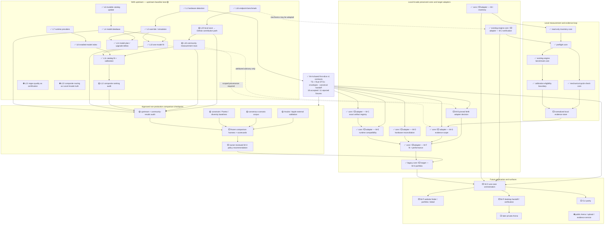

# Ranking research assembler

Status: **Active checkpoint dashboard**, 2026-07-22. This document tracks the
owner-approved non-production ranking/audition research. It is an assembler
view, not evidence that future modules are implemented.

## Status legend

- ✅ implemented/audited baseline available
- 🟡 research lane active
- ⬜ future checkpoint or adapter not started
- ⛔ explicitly rejected or excluded from this checkpoint

## Combined llmfit and Local Arcade operation graph

This is a Mermaid architecture flowchart and dependency graph, adapted from the
detailed graph in `system-operation-graph.md`. M-A is the shared wire boundary
between upstream/domain evidence and every future orchestrated surface.

## Active lanes

| Lane | Status | Baseline | Deliverable | Integration rule |
|---|---|---|---|---|
| assembler/root | 🟡 active | M-A commit `55afbb2` | shared schema, combined graph, progress, final comparison | only root merges or changes shared research contracts |
| upstream-baseline | 🟡 active — `codex/research-upstream`, `G:/LocalArcade-worktrees/upstream` | research baseline `4e153f6` (contains M-A `55afbb2`) | llmfit rank/community pipeline audit and normalized examples | no production adapter/ranking changes |
| ranking-methods | 🟡 active — `codex/research-ranking`, `G:/LocalArcade-worktrees/ranking` | research baseline `4e153f6` (contains M-A `55afbb2`) | non-production constraint/Pareto/diversity baselines | experimental paths only |
| consensus-corpus | 🟡 active — `codex/research-consensus`, `G:/LocalArcade-worktrees/consensus` | research baseline `4e153f6` (contains M-A `55afbb2`) | sourced scenarios and consideration/exclusion rules | consensus remains defeasible |
| apple-validation | 🟡 worktree ready / agent queued — `codex/research-apple`, `G:/LocalArcade-worktrees/apple` | research baseline `4e153f6` (contains M-A `55afbb2`) | Anubis schema/terms and reference-only matched cases | no GPL copying or unlicensed ingestion |

## Community-result questions assigned to upstream lane

The upstream audit must establish from source and fixtures:

1. what llmfit records locally after a benchmark;
2. how a user explicitly opts into contribution;
3. how authentication/device flow and GitHub PR creation work;
4. which validation runs before the PR is produced;
5. which exact hardware, model, runtime, settings, sample and provenance fields
   survive into a community row;
6. how rows are reviewed, merged, embedded and matched to another user;
7. whether local, llmfit-community and localmaxxing measurements remain
   distinguishable;
8. license/terms and whether Local Arcade may reference, cache or redistribute
   those rows;
9. trust weaknesses: self-reporting, duplicate submissions, version drift,
   malicious rows, selection bias and incomparable settings.

Until that audit lands, community rows are useful candidate evidence but are
not automatically eligible for exact Local Arcade ranking or publication.

## Progress log

- ✅ Wave 0 preservation/documentation baseline committed: `59e6dd1`.
- ✅ M-A shared contracts approved and committed: `55afbb2`.
- ✅ Ranking/audition research plan approved by the product owner.
- ✅ Four research worktrees created from shared baseline `4e153f6`.
- 🟡 Upstream, ranking-method and consensus lanes active; Apple lane queued for
  the next agent slot.
- ✅ Research-only comparison interchange v1 created under
  `research/comparison/`; valid smoke fixture passes and forward version fails.
- ⬜ Lane artifacts reconciled into the shared interchange and harness.
- ⬜ Comparative scorecards complete.
- ⬜ Owner selects or rejects an M-H policy.
