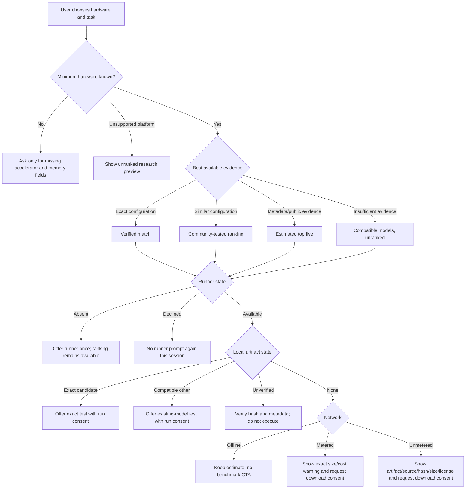

# Recommendation decision system

Status: product contract. Changes to this document and `lib/recommendation-policy.mjs` must ship together.

## Core separation

Ranking and benchmarking are independent decisions:

- The **ranking path** decides what evidence may be shown and what it may be called.
- The **benchmark path** decides what optional action is safe and useful on this device.

A missing runner or model never prevents a no-download estimate. A benchmark never upgrades quality evidence by itself unless the exact configuration and task evidence satisfy the verified-match definition.

## Ranking states

| Evidence | User-visible label | Ordered? | Allowed claim | Forbidden claim |
|---|---|---:|---|---|
| Exact hardware + runtime + artifact + settings + task | Verified match | Yes | “Verified on this configuration” | “Best model” |
| Comparable configuration | Community-tested | Yes | “Observed on similar systems” | “Measured on your machine” |
| Fit calculation and public evidence | Estimated top five | Yes | “Likely to fit; predicted range” | “Community-tested” |
| Insufficient evidence | Compatible models | No | “These appear compatible” | Any rank ordering |
| Missing minimum hardware | No result | No | Request missing fields | Guessing the hardware |
| Unsupported platform | Research preview | No | Compatibility caveats | Performance prediction |

“Exact” requires an exact artifact hash and runtime build, not merely the same model family or GPU name. Driver, available memory, context, and important runtime settings must fall inside the study’s accepted equivalence policy.

## Benchmark branches and edge cases

### Exact candidate already installed

- Verify the file hash before offering execution.
- If settings differ, create a new configuration result; never overwrite another result.
- Require run consent even when the runner is already installed.
- If interrupted, store a partial local record but do not publish or score it.
- If the device becomes active, hot, low on battery, or memory constrained, pause or block according to the user’s safeguards.

### Another compatible model is installed

- Testing it can improve the user’s evidence but does not verify a different recommended artifact.
- Preserve runtime identity: Ollama, LM Studio, direct llama.cpp, and MLX are separate configurations.
- If the underlying artifact cannot be identified, label it unverified and exclude it from public aggregate rankings.
- Never import, copy, convert, or delete an existing model without separate consent.

### No model is installed

- Keep the estimated or community leaderboard visible; installation is not a prerequisite.
- Offline: show no dead download button and allow the result to be saved locally.
- Metered: show exact bytes and likely temporary disk requirement before consent.
- Unmetered: still require consent; network type is not permission.
- Insufficient storage: include model, cache, temporary download, and safety margin in the calculation.
- Gated license: send the user to the authoritative license source; never accept for them.
- Failed or resumed download: verify the complete hash before execution and never treat partial files as models.

### Runner absent or declined

- Offer it only after presenting useful results.
- Declining does not reduce ranking access or confidence.
- Do not repeatedly prompt during the session.
- Manual hardware entry is labeled self-reported and never silently upgraded to detected hardware.

### Artifact or runtime unsupported

- Do not silently fall back to a different quantization or runtime.
- Explain which dimension is unsupported and preserve the original recommendation.
- A conversion creates a new artifact identity and requires its own evidence.
- Proprietary or encrypted artifacts may be used privately only when their terms allow it; never redistribute them.

### Results and aggregation

- Separate prompt processing from token generation speed.
- Report warm and cold load time separately.
- Record context, batch size, GPU offload, cache quantization, power mode, thermals, driver, runtime build, and artifact hash.
- Flag display-attached GPUs, multi-GPU topology, CPU offload, background load, and thermal throttling rather than pretending runs are identical.
- Reject impossible telemetry and quarantine statistical outliers; do not delete inconvenient valid results.
- Never publish prompts or outputs until the upload preview and study-specific consent are accepted.
- A benchmark measures performance and quick-task success. It does not establish general intelligence or human preference.

## Hard invariants

1. No download without artifact-specific consent.
2. No execution without run-specific consent.
3. No public upload without a payload preview and upload consent.
4. No “verified” label without exact qualifying evidence.
5. No ordered ranking when evidence is insufficient.
6. No hidden substitution of artifact, quantization, runtime, or settings.
7. No loss of basic recommendations when the runner is absent or declined.
8. No merging results across materially different runtime configurations.
9. No use of self-reported hardware as attested telemetry.
10. No claim that a short benchmark proves overall model quality.

## Operational completeness

`tests/recommendation-policy.test.mjs` enumerates the Cartesian product of every declared decision dimension. Every combination must return one ranking state, one benchmark state, explicit authorization, and claim boundaries. Adding a dimension value without handling it must fail the tests.

The policy is not yet device-control code. It is the contract that future UI, API, and runner implementations must consume rather than independently recreating branching logic.
