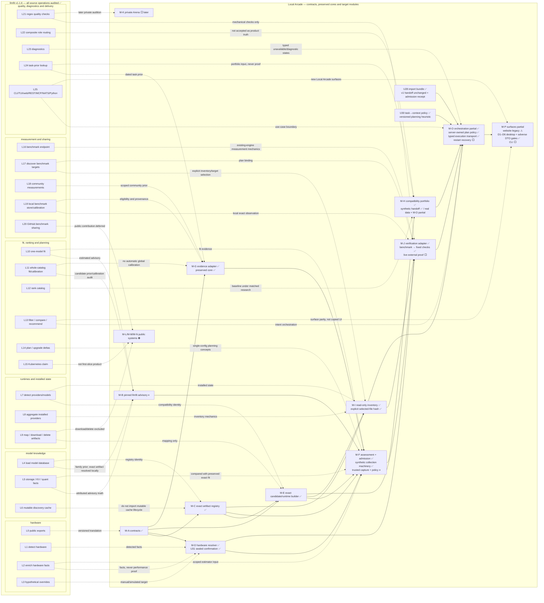
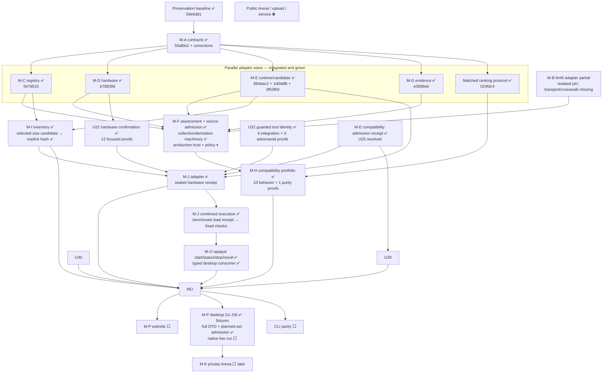

# Local Arcade system build assembler

Status: **Active implementation dashboard**, 2026-07-22. This is a progress
overlay on the audited llmfit operation map and the approved Local Arcade
module target. A check on an upstream L-box means its source behavior was
audited; it does not mean Local Arcade adopted or reimplemented it.

## Legend

- ✅ complete or audited, with evidence available
- 🟡 active on the integration branch
- ⬜ queued behind an explicit dependency
- ⏸ owner decision or research evidence required
- ⛔ excluded from the approved first slice

## Graph 1 — complete llmfit box mapped into Local Arcade

The detailed inputs, outputs, side effects and callables for L0–L25 remain in
[the source operation audit](system-operation-graph.md). This view keeps every
upstream operation visible while allowing many-to-many adoption boundaries.

## Graph 2 — implementation checkpoints and parallel tracks

## Active branch ledger

| Track | Branch/worktree | Current state | Completion evidence |
|---|---|---|---|
| assembler and integration | `codex/wave1-domain-adapters` — `G:/LocalArcade` | ✅ first wave integrated | root and runner full gates green on 2026-07-22 |
| current M-I/M-O/M-P native-handoff batch | `codex/wave1-domain-adapters` — `G:/LocalArcade` | 🟡 uncommitted shared-worktree integration | Explicit selected-file hash promotion, server-owned fixed-plan policy, full result/planned-set admission and synthetic-only U27 collection research; 80 Rust library, 19 surface and 11 boundary tests; no native live-model claim |
| M-C registry | `codex/m-c-registry` — `G:/LocalArcade-worktrees/m-c-registry` | ✅ integrated as `547d015` | adapter/equivalence tests and unchanged snapshot semantics |
| M-D hardware | `codex/m-d-hardware` — `G:/LocalArcade-worktrees/m-d-hardware` | ✅ base integrated as `b788396`; U31 uncommitted in assembler | manual/detected/unknown/mismatch boundary tests; 12 U31 material-fact/acknowledgement proofs |
| M-E runtime | `codex/m-e-runtime` — `G:/LocalArcade-worktrees/m-e-runtime` | ✅ integrated as `884dac2`, `1d0ddfb`, `0f53fb9` | exact candidate rejection tests and reviewed M-C→M-E seam |
| M-G evidence | reused M-E review lane | ✅ integrated as `e3689eb` | exact/lossy/unsupported mappings and boundary tests |
| M-I inventory | `codex/m-i-inventory` — `G:/LocalArcade-worktrees/m-i-inventory` | ✅ integrated as `8d26720`, `6a9d860`, `dc87da1` | 11 inventory tests, 2 boundary tests, TypeScript equivalence, and independent mutation audit |
| M-J verification | `codex/m-j-verification` — `G:/LocalArcade-worktrees/m-j-verification` | ✅ base adapter integrated; execution producer uncommitted in assembler | Original commits plus U32 identity, fixed benchmark/quick protocols, suspended/job-owned process boundary, official JSON admission and genuine M-J preparation reachability; live external proof and surfaces remain queued |

## Gate snapshot — 2026-07-23

- Root gates: ✅ typecheck, lint, 155 TypeScript/UI tests, 36 boundary tests,
  registry freshness and production build.
- Runner `npm.cmd run check`: ✅ TypeScript, Rust formatting, Clippy with
  warnings denied, 164 Rust tests across all targets, and production build.
- U33–U37 execution subset: ✅ 15 fake-runner service tests, 5 transport tests
  and 80/80 combined Rust library tests. Combined plans run the benchmark
  before fixed quick checks; quick-only plans fail closed without structured
  load evidence. Typed Tauri commands are registered and consumed by the M-P
  desktop facade; no native live-model run is claimed.
- Contracts: ✅ 20 positive, 12 schema-negative and 12 semantic-negative
  fixtures. Documentation: ✅ UTF-8, mojibake and relative links across all
  80 Markdown files. The M-O/M-P capability and interface proofs pass.

## Mapping rule

The L and M namespaces intentionally describe different things. L0–L25 are
audited upstream source operations; M-A–M-P are Local Arcade responsibility and
permission boundaries. One L operation may inform several M modules, and a
Local Arcade module may combine preserved local behavior with only a narrow,
attributed part of llmfit. Progress remains attached to each Local Arcade
module across as many checkpoints as necessary; a partially wrapped core does
not become complete merely because one adapter exists.
