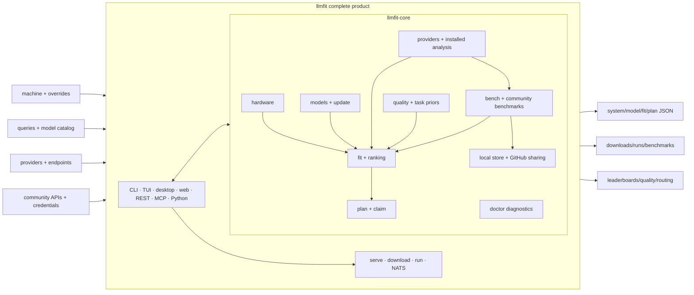
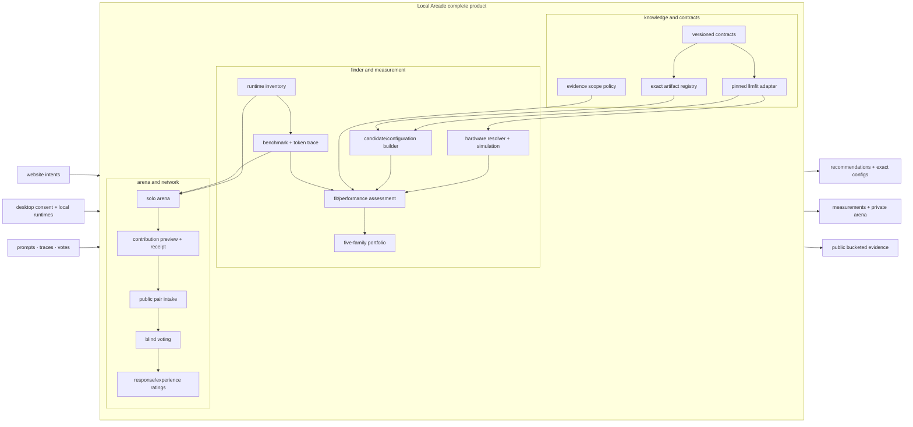
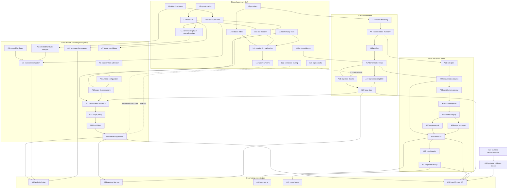

# llmfit and Local Arcade: complete operation graph

Status: design draft. No implementation authorization.

Pinned llmfit source: v1.1.6, commit
`7ba90ce0f14756040db658933bfd5c6ad46ed4ea`, audited 2026-07-21.

This document answers four questions for every functional box:

1. What exact inputs and parameters enter it?
2. What processing is implemented or proposed inside it?
3. What exact output leaves it?
4. Which box consumes that output next?

The source-level type and adoption discussion remains in
[llmfit-core-adoption-audit.md](llmfit-core-adoption-audit.md). The Local
Arcade JSON examples remain in
[modular-architecture-v2.md](modular-architecture-v2.md). Ranking, prompt
provenance, experimental harness evidence, API and novice journeys are specified
in [evidence-ranking-api-ux.md](evidence-ranking-api-ux.md).

## Plain-English glossary

| Term used below | Exact meaning | What it does **not** mean |
|---|---|---|
| Optional cluster state | llmfit's `SystemSpecs` can describe several machines/GPUs acting as one vLLM tensor-parallel cluster: whether cluster mode is active and its node count. | It is not required for a normal PC, and Local Arcade v1 should mark clusters unsupported rather than expose this to novices. |
| User/query parameters | Values supplied by a person or API call for one calculation: model name, task, context, quantization, target speed, filters or hypothetical capacities. | It is not user history and is not automatically uploaded. |
| Model selector | A string or ID used to find one catalog record, such as a full Hugging Face ID, model name or unambiguous substring. | It is not a second model-selection algorithm or a routing module. |
| Model knowledge | Structured metadata about model families: IDs, parameter count, architecture, context, capabilities, license, formats and sizing facts. | It is not the model weights and does not prove quality. |
| Local runtime state | Which inference products/engines and model artifacts are installed or reachable on the current machine. | It is not prompt or conversation history. |
| Community data | Performance measurements contributed by other machines or obtained from a benchmark service, matched to hardware/model/configuration as tightly as the schema permits. | It is not automatically trustworthy or transferable to every machine. |
| Optional mutation credentials | Secrets used only for an action that changes remote state, accesses a protected resource or raises a service limit. llmfit uses a Hugging Face token for catalog/API access, a localmaxxing API key for its benchmark API, and a GitHub token/device login to open a benchmark-data PR. | They are not needed for pure local fit arithmetic and must never enter event/report payloads. |
| Pure calculation | Given identical explicit inputs, it returns the same result without reading the clock/network/disk or changing anything outside the function. | It does not mean the result is automatically correct; a pure estimator may still have a bad formula. |
| Local benchmark store | Pending and historical benchmark records written on the user's machine. | Local storage is not sharing. |
| GitHub benchmark sharing | An explicit llmfit flow that previews pending local benchmark payloads, authenticates, then creates or updates a pull request under `llmfit-core/data/community`. Merged rows are embedded in a later llmfit release. | It is not invisible telemetry. |
| `bench` | Actively run prompts against a reachable local inference endpoint and measure throughput/latency. | It is not a general model-quality evaluation. |
| `community benchmarks` | Read previously collected measurements and match them to the current hardware/model preset. | It does not execute anything locally. |
| Hardware resolver | Convert manual input or detector output into one normalized hardware identity with provenance and explicit unknowns. | It is not the fit estimator. |
| Knowledge and contracts | Versioned schemas and registries shared by otherwise independent modules: hardware IDs, artifact identities, runtime configurations, evidence types and consent receipts. | It is not a generic database bucket or business logic hidden in schemas. |

# Part I: whole-system boxes

## llmfit as one black box

### Aggregate inputs

```text
Current machine
  RAM, available RAM, CPU identity/cores, GPUs, VRAM, unified memory,
  OS commands/APIs, optional llmfit multi-node cluster state

User/query parameters
  model selector, use case, capabilities, license, fit threshold, sort,
  context, quantization, KV quantization, target TPS, result limit,
  runtime constraint, hypothetical RAM/VRAM/CPU overrides

Model knowledge
  embedded model catalog, local update cache, custom model file,
  quantization formulas, task priors, frontier baseline file

Local runtime state
  Ollama, llama.cpp, MLX, Docker Model Runner, LM Studio, vLLM, RamaLama

Inference endpoints
  Ollama generate API and OpenAI-compatible chat/model APIs

Community data
  embedded benchmark snapshots, llmfit submissions, localmaxxing API

Optional mutation credentials
  Hugging Face token, localmaxxing API key, GitHub token/device flow
```

### Processing inside the box

```text
detect hardware
load/update/search model catalog
detect installed providers and models
estimate artifact size, KV cache, memory fit, run path and throughput
rank/filter/recommend/compare models
simulate hypothetical hardware
plan minimum/recommended hardware for one model
generate Kubernetes resource claims
download/delete/run provider models
benchmark running endpoints
apply local/community throughput calibration
run regex quality tests and composite role routing
fetch community leaderboards
store and share benchmark submissions
produce diagnostics
serve the same capabilities through CLI/TUI/web/REST/MCP/NATS/Python
```

### Aggregate outputs

```text
SystemSpecs
ModelDatabase / LlmModel records
InstalledIndex and provider availability
ModelFit rows and ranked recommendation lists
PlanEstimate and UpgradeDelta records
Kubernetes claim YAML/JSON
PullHandle progress / downloaded files / launched llama.cpp process
BenchResult and local benchmark files
MeasuredTps / BenchmarkResponse / LeaderboardResponse
QualityResult / RoutingRecommendation
GitHub benchmark PR receipt
diagnostic Markdown
REST JSON, MCP tool responses and optional NATS events
```

### Aggregate side effects

The fit and planning calculations can be pure once their inputs exist. The
complete llmfit box is not pure: it may execute OS inspection commands, query
localhost providers, contact Hugging Face/localmaxxing/GitHub, write caches and
benchmark files, download/delete models, launch llama.cpp, bind a server, and
publish NATS events.



## Local Arcade as one black box

### Aggregate inputs

```text
Website: manually chosen hardware, task, patience and constraints
Desktop: consented hardware detection and model-store inventory
Pinned llmfit advisory output
Exact artifact registry and runtime compatibility records
Local and community measurements with provenance
User prompts, generated attempts, token traces and votes
Contribution field choices and consent
```

### Processing inside the box

```text
normalize manual/detected hardware
resolve llmfit model-family suggestions to immutable artifacts
construct exact runtime configurations
calculate fit and attach scoped performance evidence
refuse unsupported ranking and produce a five-family portfolio
run exact configuration benchmarks and objective quick checks
create private sequential solo battles
admit public response/experience pairs under integrity rules
collect blind votes and maintain separate bucketed ratings
preview, consent to and submit selected contributions
```

### Aggregate outputs

```text
honest no-install recommendation portfolio
exact configuration setup/benchmark plan
private measured inventory and personal arena history
public response ratings, experience ratings and DNF evidence
reproducible measurement/report bundles
consent-bound contribution receipts
optional vendor-neutral exact-configuration evidence package
```



# Part II: exact llmfit-core operation map

## Source-module coverage

This table is the completeness check for the `llmfit-core` crate. The box around
L1-L24 is the complete core library; L25 is the set of product surfaces that
orchestrate it.

| `llmfit-core` source module | Operation boxes containing its behavior |
|---|---|
| `analysis` | L8 installed aggregation; L11 catalog fit/calibration |
| `bench` | L16 endpoint benchmark; L17 target discovery; L19 local storage/calibration |
| `benchmarks` | L18 community measurements and leaderboards |
| `claim` | L15 Kubernetes resource claim |
| `doctor` | L23 diagnostics |
| `fit` | L5 sizing/KV facts; L10 fit calculation; L12 ranking |
| `hardware` | L1 detection; L2 enrichment; L3 hypothetical overrides |
| `models` | L4 model knowledge; L5 model sizing facts |
| `plan` | L14 one-model planning and upgrade deltas |
| `providers` | L7 provider detection; L8 installed aggregation; L9 artifact actions |
| `quality` | L21 regex checks; L22 composite role routing |
| `share` | L20 GitHub sharing |
| `task_bench` | L24 task-prior lookup |
| `update` | L6 mutable discovery cache |

No source module is silently omitted. Not every Rust helper becomes its own
box: parsing a memory suffix belongs to L2, while estimating KV bytes belongs
to L5. The callable names inside each box make that grouping explicit.

## L0. Public crate exports

The crate root re-exports the main objects from `analysis`, `fit`, `hardware`,
`models`, `plan`, `providers`, and `update`. The other modules are public but
their items are accessed through their module paths.

The following sections list functional operations. Cosmetic label/display
helpers are included under their owning output rather than drawn as separate
domain boxes.

## L1. Detect real hardware

**Callable:** `SystemSpecs::detect() -> SystemSpecs`

**Required input:** none from the caller.

**Implicit inputs:** current OS, RAM/CPU APIs, available accelerator tools and
drivers, environment, WSL/cluster context.

**Parameters exposed:** none.

**Process implemented:**

1. Read total/available RAM and CPU identity/cores.
2. Probe platform-specific GPU/NPU paths.
3. Normalize GPU backend.
4. Detect per-device and aggregate memory.
5. Distinguish unified memory and recommended GPU working-set memory.
6. Represent multi-GPU and optional cluster state.

**Output:** `SystemSpecs` and nested `GpuInfo` records.

**Side effects:** read-only OS commands/APIs.

**Consumed by:** fit, planning, provider analysis, community query construction,
benchmark storage, REST/MCP system output.

## L2. Parse and enrich hardware facts

| Operation | Inputs | Process | Output |
|---|---|---|---|
| `parse_memory_size` | string such as `32G`, `32000M`, `1.5T` | parse suffix and normalize to GiB | `Option<f64>` |
| `measured_ram_bandwidth_gbps` | current machine | run/cache a memory-bandwidth measurement when available | optional GB/s |
| `gpu_memory_bandwidth_gbps` | GPU display name | match internal device table | optional GB/s |
| `gpu_compute_capability` | GPU display name | match NVIDIA architecture/device table | optional `(major, minor)` |
| `quant_min_compute_capability` | quantization string | map quant kernel requirement | optional minimum capability |
| `is_running_in_wsl` | current process | inspect runtime environment | boolean |

These are helper evidence inputs to fit estimation, not user-visible measured
model performance.

## L3. Simulate hypothetical hardware

This is the first exact location of the requested “what if I had more RAM?”
behavior.

**Callables:**

```rust
specs.with_gpu_memory_override(vram_gb)
specs.with_ram_override(ram_gb)
specs.with_cpu_core_override(cores)
```

**REST parameters:** `ram_gb`/`ram`, `vram_gb`/`memory`, `cpu_cores` on system,
model-query and plan endpoints.

**CLI parameters:** `--ram`, `--memory`, `--cpu-cores` globally.

**Required input:** a detected `SystemSpecs` plus one or more positive override
values.

**Process implemented:** clone/consume the system record, replace the selected
capacity, create a synthetic GPU where required, and preserve other detected
facts. Unified-memory behavior links RAM and VRAM unless explicitly separated.

**Important limit:** upstream exposes capacity overrides for RAM, VRAM and CPU
cores. It does not expose an honest arbitrary-device replacement such as
"change my RTX 3060 into an RTX 4090." A VRAM override normally preserves the
detected GPU/backend characteristics; on a CPU-only input it creates a generic
`User-specified GPU`. Therefore it cannot capture a replacement GPU's memory
bandwidth, backend/kernel support, architecture, power or measured behavior.

**Immediate output:** a hypothetical `SystemSpecs`.

**Final output depends on consumer:**

- Feed to `build_model_fits` to answer “what would the whole catalog look like?”
- Feed to `estimate_model_plan` to answer “would this one model fit?”
- Feed to REST `GET /api/v1/models` to return a hypothetical ranked list.

**Side effects:** none after the original detection.

## L4. Load model knowledge

**Callables:**

```rust
ModelDatabase::embedded()
ModelDatabase::new()
ModelDatabase::get_all_models()
ModelDatabase::find_model(query)
ModelDatabase::models_fitting_system(available_ram_gb, has_gpu, vram_gb)
```

**Inputs:** embedded JSON; optional user custom-model file; optional local
Hugging Face update cache; search query or coarse RAM/GPU filter.

**Process implemented:** parse, canonicalize names, merge duplicates and cache,
infer capabilities/attention layouts/use cases, retain model/quant/architecture
metadata.

**Outputs:** `ModelDatabase`, `Vec<LlmModel>`, or matching references.

**Side effects:** `new()` may read local files; embedded-only is pure.

## L5. Calculate model storage, KV and quantization facts

| Operation | Required parameters | Processing | Output |
|---|---|---|---|
| `quant_bpp` | quant string | map quant scheme to effective bits/parameter | `f64` |
| `quant_bytes_per_param` | quant string | convert quant storage density | bytes/parameter |
| `quant_speed_multiplier` | quant string | map quant to heuristic speed factor | multiplier |
| `quant_quality_penalty` | quant string | map quant to heuristic quality penalty | penalty |
| `LlmModel::estimate_disk_gb` | quant | parameters × quant density | estimated GB |
| `estimate_memory_gb` | quant, context | weights + fp16 KV + overhead | estimated GB |
| `estimate_memory_gb_with_kv` | quant, context, KV quant | weights + selected KV + overhead | estimated GB |
| `kv_cache_gb` | context, KV quant | architecture-aware KV formula | KV GB |
| `best_quant_for_budget` | budget GB, context | test built-in quant hierarchy | optional quant and GB |
| `best_quant_for_budget_with` | budget, context, supplied hierarchy | test caller hierarchy | optional quant and GB |
| `moe_active_vram_gb` | model | compute active-expert device need | optional GB |
| `moe_offloaded_ram_gb` | model | compute inactive-expert host need | optional GB |
| `supports_tp` / `valid_tp_sizes` | TP size or model | inspect attention/KV head divisibility | boolean/list |

These outputs feed fit and planning. They are formula outputs, not real
allocation measurements.

## L6. Refresh mutable model discovery cache

**Callable:**

```rust
update_model_cache(
  UpdateOptions { trending_limit, downloads_limit, token },
  progress_callback
) -> Result<(new_count, total_cached), String>
```

**Inputs:** limits, optional Hugging Face token, embedded model names, network.

**Process implemented:** query trending/downloaded models, normalize metadata,
exclude embedded duplicates, merge and write local cache, call progress hook.

**Output:** added count, total cached count, updated cache file.

**Other operations:** `cache_dir`, `cache_file`, `load_cache`, `save_cache`,
`clear_cache`.

**Side effects:** Hugging Face network access and local file writes/deletion.

## L7. Detect runtimes and installed models

**Common trait:**

```rust
ModelProvider {
  name()
  is_available()
  installed_models()
  start_pull(model_tag)
}
```

**Provider implementations:** Ollama, llama.cpp, MLX, Docker Model Runner,
LM Studio, vLLM, RamaLama.

**Inputs:** provider-specific environment variables, paths, command presence,
model stores and localhost APIs.

**Parameters:** provider host/path where supported; model tag for pull; optional
custom llama.cpp model directory.

**Process implemented:** determine availability; enumerate normalized model
names; map Hugging Face identities to provider tags; count actual files/models.

**Outputs:** availability boolean, installed-name set/count, provider identity.

**Side effects:** read-only filesystem/local API access for detection.

## L8. Aggregate installed providers

**Callable:** `InstalledIndex::detect_all()`.

**Inputs:** all provider adapters.

**Process implemented:** probe providers concurrently so one timeout does not
serialize all detection; retain provider-specific sets and counts.

**Output:** `InstalledIndex` with Ollama, MLX, llama.cpp, Docker, LM Studio,
vLLM and RamaLama sets/counts.

**Queries exposed:**

- `is_installed(model_name) -> bool`
- `installed_providers(model_name) -> Vec<provider label>`

**Consumed by:** full model-fit analysis and UI/API installed markers.

## L9. Map, download and delete provider artifacts

**Inputs:** HF/model identity, provider, repository, filenames, memory budget,
destination/model store.

**Parameters exposed:** search query, repo ID, budget GB, selected filename,
models directory, provider tag.

**Processes implemented:**

- generate provider-specific candidate names;
- test whether provider mapping exists;
- search HF GGUF repositories;
- enumerate repo GGUF files;
- group multipart shards;
- choose a GGUF under budget;
- download through provider/direct HF path;
- emit pull progress;
- delete where provider supports it.

**Outputs:** candidate tags, file lists, selected file, `PullHandle` event stream,
downloaded file, or `Result<(), String>` deletion result.

**Side effects:** network, filesystem mutation, provider mutation.

## L10. Calculate one model fit

**Callables and parameters:**

```rust
ModelFit::analyze(model, system)
ModelFit::analyze_with_context_limit(model, system, context_limit)
ModelFit::analyze_with_forced_runtime(model, system, context_limit, runtime)
ModelFit::analyze_with_config(model, system, CalcConfig)
```

`CalcConfig` exposes:

- `context_cap`
- bandwidth efficiency
- GPU/tensor-parallel/MoE-offload/CPU-offload/CPU-only speed factors
- per-use-case quality/speed/fit/context scoring weights
- DDR bandwidth override

**Process implemented:**

1. Select estimation context.
2. Select compatible inference runtime.
3. Choose quantization that fits the relevant memory budget.
4. Calculate weights, KV and runtime memory.
5. Select GPU, tensor parallel, MoE offload, CPU offload or CPU-only path.
6. Assign `Perfect`, `Good`, `Marginal` or `TooTight`.
7. Calculate usable context.
8. Estimate generation TPS from bandwidth/backend constants.
9. Calculate heuristic quality, speed, fit and context components.
10. Apply use-case weights to a composite score.
11. Emit assumptions and notes.

**Output:** complete `ModelFit` including fit/run mode, memory, usable/effective
context, quant, runtime, TPS, estimate basis, score components, composite,
notes, install marker and optional measured TPS.

**Side effects:** pure given model/system/config, except optional RAM-bandwidth
lookup used by the default path may measure/cache machine bandwidth.

## L11. Build and calibrate the whole catalog

**Callable:**

```rust
build_model_fits(db, specs, installed, context_limit, forced_runtime)
```

**Inputs:** model database, real or hypothetical hardware, installed index,
optional context limit/runtime.

**Process implemented:** backend filtering, per-model L10 analysis, installed
markers, local/community measurement lookup, local calibration.

**Measurement precedence:** local run on this machine, llmfit submission on
matching hardware, localmaxxing matched median.

**Output:** unsorted `Vec<ModelFit>`.

`apply_local_calibration(fits)` calculates a median measured/estimated ratio
from eligible dense models, clamps it to `[0.05, 3.0]`, rescales estimates and
records the factor.

## L12. Rank the catalog

**Callables:**

- `rank_models_by_fit(models)`
- `rank_models_by_fit_opts(models, installed_first)`
- `rank_models_by_fit_opts_col(models, installed_first, sort_column)`

**Inputs:** analyzed rows, optional installed-first switch, sort column.

**Process implemented:** compare fit/run path/composite or selected numeric/
categorical field with stable tie behavior.

**Output:** sorted `Vec<ModelFit>`.

**Important:** this is where llmfit's heuristic composite becomes ordering.
Local Arcade must not inherit this ordering without its own evidence policy.

## L13. Filter, compare and recommend through delivery surfaces

The CLI/REST layer composes L11/L12 with filters.

**Inputs exposed:** result limit, perfect/min-fit, runtime, forced runtime, use
case, provider, capability, license, search, sort, include-too-tight, context,
RAM/VRAM/core overrides, installed-first.

**Outputs:** list, fit table/JSON, one-model info, two/N-model diff, or top-N
recommendation envelope with system, echoed filters and model-fit rows.

**Side effects:** read-only unless provider detection is considered an external
read.

## L14. Plan one model and produce upgrade deltas

This is the second exact location of “what if I had more RAM?”

**Core callable:**

```rust
estimate_model_plan(
  model,
  PlanRequest {
    context,
    quant,
    target_tps,
    kv_quant
  },
  real_or_hypothetical_system
) -> Result<PlanEstimate, String>
```

**REST call:**

```http
POST /api/v1/plan
```

```json
{
  "model": "Qwen/Qwen3-4B-Instruct-2507",
  "context": 32768,
  "quant": "Q4_K_M",
  "kv_quant": "q8_0",
  "target_tps": 40,
  "ram_gb": 64,
  "vram_gb": 12,
  "cpu_cores": 16
}
```

**CLI call:**

```text
llmfit --ram 64G --memory 12G plan <model> \
  --context 32768 --quant Q4_K_M --kv-quant q8_0 --target-tps 40 --json
```

**Process implemented:** normalize quant; validate target; calculate GPU,
CPU-offload and CPU-only paths; calculate minimum/recommended hardware per
path; compare current/hypothetical hardware; calculate target-TPS feasibility;
calculate alternative KV footprints; emit resource deltas.

**Output `PlanEstimate`:** notice, model/provider, context, quant/KV quant,
target TPS, minimum and recommended hardware, three path estimates, current
fit/run mode/TPS, `upgrade_deltas`, and KV alternatives.

An `UpgradeDelta` names RAM/VRAM/cores to add, target fit, path and human
description. That record is the direct machine-readable answer to “how much
more RAM would change this?”

## L15. Generate a Kubernetes resource claim

**Input:** model plus `ClaimTarget { min_tps, efficiency_pct, device_class,
template, quant, name }`.

**Process:** calculate quantized weight size, memory floor and bandwidth floor;
embed these in Kubernetes DRA CEL selectors.

**Output:** `FitBounds`, YAML claim/template, or JSON-rendered result.

**Side effects:** none until a caller pipes output to Kubernetes.

## L16. Benchmark a running endpoint

**Callables:**

```rust
bench_ollama(base_url, model, num_runs, progress_callback)
bench_openai_compat(base_url, model, provider_name, num_runs, progress_callback)
```

**Inputs:** endpoint URL, served model name, run count, four rotating built-in
prompts, one warm-up prompt.

**Process:** warm endpoint; run non-streaming generations; record provider or
wall-clock token timings; aggregate averages/min/max.

**Output:** `BenchResult { model, provider, runs, summary }`.

**Side effects:** inference calls and compute usage; no persistence unless
passed to sharing/storage.

## L17. Discover benchmark targets

| Operation | Parameters | Process | Output |
|---|---|---|---|
| `llamacpp_url` | environment | resolve llama-server URL | URL string |
| `probe_llamacpp` | base URL | call `/props` with timeout | boolean |
| `detect_model_from_url` | base URL, optional hint | query OpenAI models and resolve | model or error |
| `auto_detect_target` | optional model hint | probe vLLM, Ollama, llama.cpp, MLX in order | one `BenchTarget` |
| `discover_all_targets` | environment/localhost | enumerate models across providers | `Vec<BenchTarget>` |

## L18. Query community measurements

**Inputs:** `SystemSpecs`, optional HF/model ID, optional API key, limit, or a
selected `HardwarePreset`.

**Processes:** translate hardware into query parameters; match embedded cache;
fetch model-specific/general benchmarks or leaderboard; normalize nested
hardware/model/engine/user records; distinguish speculative/MTP flags.

**Outputs:** `BenchmarkResponse`, `LeaderboardResponse`, `MeasuredTps`, preset
labels/cache timestamp, or indexed lookup.

**Network operations:** `fetch_benchmarks`, `fetch_benchmarks_for_model`,
`fetch_leaderboard`, `fetch_leaderboard_for_preset`.

**Offline operations:** cached preset matching, embedded llmfit submission
matching, measured-TPS index lookup.

## L19. Store and calibrate from local benchmarks

**Inputs:** `Vec<BenchResult>` plus `SystemSpecs`.

**Process:** serialize hardware and results into local pending store; find
records matching current hardware; use newest matching model TPS.

**Outputs:** stored file path, `StoredBenchmark` list, `LocalBenchIndex`, or
`MeasuredTps` lookup.

**Side effects:** local filesystem writes/reads/moves.

## L20. Share benchmarks through GitHub

**Inputs:** pending stored benchmarks, `ShareOptions`, optional token; or GitHub
OAuth client/device codes.

**Parameters:** dry-run/confirmation behavior in `ShareOptions`, token source,
device flow polling interval.

**Process:** preview/authenticate; reject unidentified hardware; fork upstream
if needed; append to existing benchmark PR or create branch/commit/PR; skip
duplicate filenames; mark local records shared.

**Output:** `SubmitOutcome { pr_url, reused_existing_pr, uploaded, skipped }`,
device-flow state, or error.

**Side effects:** GitHub API writes, token cache, local pending/shared state.

## L21. Run regex quality tests

**Inputs:** YAML `QualityConfig`, role filter, model/endpoint, prompts, regex
rules, weights, token limits, temperatures.

**Process:** warm endpoint; generate response; sum matching/nonmatching regex
weights into 0-10; record speed; calculate per-test composite; average by role
and model.

**Outputs:** `QualityResult`, `RoleScore`, `ModelQualityResult`.

**Side effects:** inference requests.

## L22. Produce llmfit role routing

**Inputs:** `Vec<ModelQualityResult>`.

**Process:** group by role; sort composite; choose first and optional runner-up;
attach heuristic alternative notes; optionally compare to embedded frontier
baseline composites.

**Outputs:** `Vec<RoutingRecommendation>` and baseline comparison tuples.

**Local Arcade decision:** rejected as quality/routing authority.

## L23. Diagnostics

**Callable:** `collect_diagnostics(version)`.

**Inputs:** program version and current OS detection environment.

**Process:** capture raw outputs/status from hardware-detection commands and
compare them to normalized detection.

**Output:** Markdown report.

**Side effects:** read-only command execution.

## L24. Task prior lookup

**Callable:** `task_bench::score(name_lower, task)`.

**Input:** normalized model name and task identifier.

**Process:** query embedded task score table.

**Output:** optional numeric prior.

**Local Arcade decision:** prior only; never personal or arena evidence.

## L25. Delivery and orchestration surfaces

| Surface | Inputs | Calls into | Outputs/side effects |
|---|---|---|---|
| CLI | flags/subcommands/stdin environment | L1-L24 | tables, JSON, CSV, files, provider actions |
| TUI | keyboard/filter state | L1-L24 | interactive terminal and actions |
| Web dashboard | browser events | REST API | local dashboard |
| REST v1 | query/body/HTTP | hardware, fits, providers, plan | JSON; download mutations |
| MCP stdio | typed tool calls | system/recommend/search/plan/runtimes/installed | JSON strings |
| NATS feature | startup/timer/query events | system/fit/plan/runtime | published event envelopes |
| Desktop | Tauri commands | core/provider functions | native graphical surface |
| Python package | Python invocation | packaged binary/bindings surface | Python-accessible operation |

# Part III: exact Local Arcade operation map

Legend:

- **ADOPT:** call llmfit behind an adapter.
- **KEEP:** existing Local Arcade implementation remains authoritative.
- **WRAP:** retain upstream mechanism but add Local Arcade identity/evidence.
- **BUILD:** Local Arcade-specific operation not supplied by llmfit.
- **REJECT:** intentionally do not expose upstream behavior.

## A1. Normalize website hardware input — KEEP/REFINE

**Inputs:** platform/device selection, manually confirmed VRAM/unified memory,
RAM, optional CPU, source timestamps.

**Parameters:** device ID or free text; memory variant; total/available RAM;
manual confirmation boolean.

**Process:** resolve exact accelerator where possible; preserve unknown fields;
distinguish self-reported from detected; reject impossible values; derive
stable hardware target ID.

**Output:** `HardwareTargetV1`.

**Downstream:** A5 hardware simulation and A10 candidate assessment.

## A2. Detect desktop hardware — ADOPT + WRAP

**Inputs:** explicit detection consent.

**Process:** call llmfit L1; add adapter revision/detection method; retain raw
record; reconcile with Local Arcade accelerator registry; show ambiguity to
user; record confirmation/correction.

**Output:** the same `HardwareTargetV1` as A1 plus raw upstream receipt.

**Failure:** partial/unknown device produces manual completion, not guessed
identity.

## A3. Discover installed runtimes — ADOPT + WRAP

**Inputs:** explicit provider-query consent and enabled provider adapters.

**Process:** call llmfit L7/L8; normalize product versus engine; retain endpoint/
store source; report unreachable providers individually.

**Output:** `RuntimeInventoryV1` with product IDs, availability, model counts and
diagnostics.

## A4. Resolve installed files to exact artifacts — KEEP/BUILD

**Inputs:** A3 provider records, read-only store scan, artifact registry.

**Parameters:** approved directories/providers; hashing action/cap; scan limit.

**Process:** enumerate; read manifests; optionally hash exact files; match SHA or
immutable identity; deduplicate; preserve unresolved/corrupt files.

**Output:** `InstalledArtifactInventoryV1` with verified, candidate-by-size,
unresolved and unreadable records.

**Forbidden:** execute, upload or delete.

## A5. Simulate different hardware — ADOPT + WRAP

This is Local Arcade's explicit what-if module.

**Inputs:** base `HardwareTargetV1` and patch:

```json
{
  "ramBytes": 68719476736,
  "deviceMemoryBytes": 12884901888,
  "cpuCores": 16,
  "label": "What if I upgraded to 64 GB RAM and 12 GB VRAM?"
}
```

**Process:** translate base target to llmfit `SystemSpecs`; apply L3 overrides;
run L11 against candidate families; normalize back; compare to baseline fit
outcomes.

For RAM/VRAM/core-only patches this may call upstream L3 directly. Replacing a
GPU/accelerator must instead resolve an exact Local Arcade hardware-registry
entry and construct a new target with its backend, bandwidth, architecture and
evidence. It must not masquerade as llmfit's generic VRAM override.

**Output:**

```json
{
  "simulationId": "sim_...",
  "baselineHardwareTargetId": "hw_...",
  "hypotheticalHardwareTarget": {},
  "newlyRunnableFamilies": [],
  "improvedRunPaths": [],
  "unchangedFamilies": [],
  "stillBlockedFamilies": [],
  "assumptions": [],
  "evidenceClass": "estimated"
}
```

**Forbidden:** describing hypothetical outputs as measurements.

## A6. Plan hardware for one configuration — ADOPT + WRAP

**Inputs:** exact/broad model selection, context intention or token count,
quant/KV choice, target TPS, real or hypothetical hardware.

**Process:** call llmfit L14; translate model-family result to exact artifact
where possible; retain formulas; convert upgrade deltas to evidence-labeled
consumer language.

**Output:** `ConfigurationHardwarePlanV1` containing GPU/offload/CPU paths,
minimum/recommended resources, current outcome, RAM/VRAM/core deltas and
assumptions.

## A7. Discover broad model candidates — ADOPT

**Inputs:** pinned llmfit model DB, update candidate feed, user capability/
license/task filters.

**Process:** use L4/L6 as discovery only; preserve upstream model family ID and
source revision.

**Output:** `ModelFamilyCandidateV1[]`.

**Forbidden:** call these downloadable or verified exact configurations.

## A8. Admit immutable artifacts — KEEP

**Inputs:** A7 candidates, trusted-publisher policy, HF repository metadata.

**Process:** pin revision; enumerate exact files; require hash/bytes/license/
format/quant/model/template provenance; quarantine invalid files; preserve last
good snapshot.

**Output:** `ArtifactIdentityV1[]`, quarantine records and snapshot provenance.

## A9. Build exact runtime configurations — KEEP/BUILD

**Inputs:** admitted artifact, runtime compatibility assertions, selected or
defaulted configuration, hardware backend.

**Process:** enumerate only sourced compatible product/engine/backend settings;
retain unknown values; construct configuration identity hash.

**Output:** `RuntimeConfigurationV1[]`.

## A10. Calculate candidate fit — ADOPT + KEEP CROSS-CHECK

**Inputs:** hardware target, exact artifact, runtime configuration, desired
context, pinned llmfit model family.

**Process:** call llmfit L10; compare against Local Arcade pure fit goldens;
replace broad size with exact artifact bytes where possible; retain memory
breakdown and upstream estimate assumptions; fail closed on disagreement that
crosses fit boundary.

**Output:** `FitAssessmentV1`.

## A11. Attach performance evidence — KEEP/BUILD

**Inputs:** A10 assessment, llmfit formula estimate, upstream community rows,
Local Arcade measurements, exact matching policy.

**Parameters:** required identity fields per metric, confidence/range policy,
source precedence.

**Process:** retain estimates; match measurements only within permitted
hardware/artifact/runtime/settings scope; exclude speculative/MTP comparisons;
calculate range and sample metadata; never let speed become response quality.

**Output:** `PerformanceEvidenceV1` with estimated/community/local channels.

## A12. Evaluate evidence scope — KEEP

**Inputs:** claim metric and its provenance/identity.

**Process:** apply pure metric-scope policy; response/task evidence may pool
under matching inference identity; fit/speed/stability/energy/experience remain
hardware/config scoped; reject insufficient identity.

**Output:** admitted typed evidence or rejection reason.

## A13. Filter impossible/forbidden candidates — KEEP

**Inputs:** exact candidate, fit assessment, safety state, user constraints.

**Process:** check artifact promotion/freshness, backend/runtime compatibility,
memory, context, capabilities, license, download limit, offline state and safety
blockers.

**Output:** eligible candidate or excluded candidate with reason list.

## A14. Construct the five-family portfolio — KEEP

**Inputs:** eligible candidates, task/preference request, typed evidence,
optional published task-quality priors and familiarity signals.

**Parameters:** family deduplication; roles; minimum ordering evidence;
contradiction rules; maximum five; confidence policy; capped familiarity
tie-break; exploration slot policy.

**Process:** deduplicate family; nest runtime/quant variants; determine whether
ordering is supported; assign primary/quality/fast/context/light roles only
where supported; otherwise return unranked; generate evidence-linked reasons.

Do not collapse everything into one opaque score. Apply this order:

1. Hard compatibility, license, safety and fit rules exclude impossible choices.
2. Preserve separate evidence channels for fit, speed, stability, task quality,
   response preference, experience preference, popularity and confidence.
3. Construct a Pareto set: candidates that are not simply worse on every
   user-relevant dimension.
4. Use the user's stated priorities to order that set and show the component
   reasons behind the ordering.
5. Treat known benchmark/quality scores as labeled priors, never as measurements
   on this user's exact configuration.
6. Treat downloads, usage or name recognition as a **familiarity prior**, not
   quality. It may provide a small capped tie-break or reserve one familiar
   comparison candidate. It may not override a hard failure or materially
   stronger scoped evidence.
7. Reserve an exploration option when evidence is thin so new models are not
   permanently suppressed by incumbent popularity.

**Output:** `RecommendationPortfolioV1` with ranked, unranked, contradictory,
nothing-fits or coverage-gap outcome. Every ordered item retains its component
evidence, confidence and any familiarity/exploration adjustment.

**REJECT:** llmfit L12 composite as direct Local Arcade ordering.

## A15. Present recommendation — BUILD UX

**Inputs:** only A14 portfolio and typed user intents.

**Process:** render plain-language top result and adjustable assumptions;
progressively disclose exact artifact/runtime/evidence; support what-if action;
never recompute domain logic in React.

**Output:** rendered finder plus intents: change answer, simulate hardware,
inspect configuration, request coverage, open setup/benchmark handoff.

## A16. Preflight a benchmark — KEEP/BUILD

**Inputs:** exact hardware/artifact/runtime configuration, power/load/thermal/
storage state and explicit run consent.

**Process:** validate hash/config; inspect conditions; decide allowed,
conditioned or blocked; record unavailable telemetry explicitly.

**Output:** `BenchmarkPreflightV1` and immutable run authorization.

## A17. Execute performance benchmark — WRAP

**Inputs:** A16 authorization, versioned protocol, execution adapter.

**Process:** reuse useful llmfit endpoint/provider mechanics; warm up; repeat;
capture real streaming TTFT/token timestamps where supported; capture prompt/
decode speed, memory, failures and raw receipts; never silently merge unlike
runs.

**Output:** `MeasurementRunV1`.

## A18. Execute deterministic quick checks — KEEP

**Inputs:** same exact configuration, versioned task fixtures and local
verifiers.

**Process:** generate bounded outputs; mechanically validate JSON/schema/format/
fact preservation; store each criterion independently.

**Output:** `ObjectiveCheckResultV1[]`.

**REJECT:** llmfit L21 regex/composite as general quality.

## A19. Determine calibration eligibility — KEEP

**Inputs:** A16 preflight, A17 repeated samples, exact identity, stability.

**Process:** reject unstable/adverse/unknown-critical conditions; calculate
band-specific correction only where policy permits; keep measured row visible
even when calibration-ineligible.

**Output:** `CalibrationDecisionV1` and optional correction observation.

## A20. Store local measurement evidence — KEEP/BUILD

**Inputs:** A17/A18/A19 plus provenance and optional token trace blobs.

**Process:** transactional write; content-address trace/output; preserve DNF;
make local lookup exact before any broader aggregation.

**Output:** local measurement IDs, updated private configuration table.

## A21. Create a solo battle plan — BUILD

**Inputs:** two installed exact configurations, user prompt, selected response
or experience criterion, token/resource limits.

**Process:** verify artifacts/runtimes; randomize blind side assignment; schedule
sequential execution by default; create experiment identity.

**Output:** `SoloBattlePlanV1`.

## A22. Execute solo battle — BUILD

**Inputs:** A21 plan.

**Process:** run first configuration, unload/swap as needed, run second under
matched parameters, capture outputs/traces/failures, refuse pair creation when
one DNF means comparison is invalid.

**Output:** private `BattlePairV1` or two stability records plus no battle.

## A23. Present and commit blind vote — BUILD

**Inputs:** eligible pair.

**Process:** hide identities; hide latency for response battle or replay traces
for experience battle; accept left/right/tie/both-bad/skip; commit before reveal.

**Output:** `VoteV1`; then reveal state.

## A24. Construct contribution preview — BUILD

**Inputs:** user-selected measurements/pairs and per-field sharing choices.

**Process:** construct exact payload; redact excluded content; calculate size;
show destination and retention/revocation; hash preview; expire it.

**Output:** `ContributionPreviewV1`.

## A25. Record contribution consent and upload — BUILD

**Inputs:** unexpired A24 preview and explicit confirmation.

**Process:** bind consent version to preview hash; upload exactly that payload;
persist server receipt; allow queue purge/revocation where promised.

**Output:** `ContributionReceiptV1`.

## A26. Validate public measurement/pair intake — BUILD

**Inputs:** contribution payload and receipt.

**Process:** verify schema, consent, hashes, exact identity, bounded job,
hardware/config match, duplicates, canaries and content policy; quarantine or
reject failures.

**Output:** admitted measurement, eligible anonymous pair, quarantine, or
rejection.

## A27. Generate public response pairs — BUILD

**Inputs:** admitted completed outputs with same prompt/task and comparable
inference identity.

**Process:** ensure both completed; strip model identity; exclude latency/trace
from presentation; randomize sides.

**Output:** public response `BattlePairV1`.

## A28. Generate public experience pairs — BUILD

**Inputs:** admitted completed token traces from matched hardware bucket and
comparable task/config conditions.

**Process:** verify cadence timestamps; align replay controls without changing
authentic timing; randomize sides.

**Output:** public experience `BattlePairV1`.

## A29. Validate public votes — BUILD

**Inputs:** committed vote, pair, dwell/rate/canary/session signals.

**Process:** validate choice and blind state; mark eligible/excluded; retain
excluded vote for abuse analysis without updating ratings.

**Output:** `VoteIntegrityDecisionV1`.

## A30. Update separate ratings — KEEP CORE / BUILD SERVICE

**Inputs:** eligible votes grouped by battle kind, task, configuration identity
and required hardware bucket.

**Process:** Bradley-Terry/Elo policy; confidence bands; vote threshold;
prompter/third-party weighting only if approved; DNF maintained separately.

**Output:** `RatingSnapshotV1` with collecting/live state.

**Forbidden:** combine response and experience, let speed purchase response
quality, publish below threshold.

## A31. Direct coverage growth — BUILD

**Inputs:** user request for missing hardware/configuration/task evidence,
current coverage graph and contributor capacity.

**Process:** deduplicate requests; prioritize demand × general usefulness ×
coverage gap × feasible capacity; create bounded benchmark/pair jobs.

**Output:** `CoverageRequestV1`, prioritized work item or existing-result link.

## A32. Website orchestrator — BUILD

**Inputs:** manual hardware and task intents.

**Exact sequence:** A1 → A7 → A8 → A9 → A10 → A11 → A12 → A13 → A14 → A15.

Optional branches: A5 hardware simulation, A6 one-model hardware plan, A31
coverage request.

**Output:** no-install recommendation experience. No detection, execution,
download or upload occurs.

## A33. Desktop first-run orchestrator — BUILD/REFACTOR

**Inputs:** separate hardware-detection and model-scan consent.

**Sequence:** A2 → A3 → A4 → A7-A14 → A15. If benchmark chosen: A16-A20 and
then refresh A11-A14.

**Output:** detected recommendation, zero-download inventory path, optional
locally measured evidence.

## A34. Solo arena orchestrator — BUILD

**Sequence:** A21 → A22 → A23 → private rating/history update. Contribution is
an optional later A24/A25 branch, never implicit.

## A35. Crowd arena orchestrator — BUILD

**Sequence:** A26 → A27 or A28 → A23 → A29 → A30.

## A36. Portable evidence exporter — FUTURE BUILD

**Inputs:** user-selected exact Local Arcade configuration, optional admitted
evidence summary, optional A37 harness-response profile and private evaluation
identities explicitly selected for the package.

**Process:** preview fields; export exact configuration, evaluation/harness
identity, admitted metrics and provenance; exclude private prompt/output text by
default; state that every receiving system must independently qualify it against
the user's workflow.

**Output:** `ConfigurationEvidenceBundleV1`.

## A37. Measure harness responsiveness — EXPERIMENTAL BUILD

**Inputs:** exact configuration, versioned task pack, baseline harness recipe,
bounded candidate recipes, objective/preference evaluators and repetitions.

**Process:** run baseline and candidate recipes under controlled identity; score
held-out tasks; measure lift, regressions, transfer, stability, token/latency
cost and recipe complexity; retain every component and claim boundary.

**Output:** experimental `HarnessResponseProfileV1` for API/research/downstream
handoff. It is not displayed as consumer “teachability” and makes no weight
adaptation claim.

## A38. Serve Local Arcade contracts — BUILD

**Inputs:** versioned HTTP requests for recommendation, explanation, simulation,
planning, configuration resolution, measurement plans/runs, battle plans/votes,
harness experiments, evidence lookup and portable export.

**Process:** validate contracts; authenticate where required; call the named A
operations without recreating their domain logic; preview mutations; enforce
idempotency; return provenance and receipts; advertise hosted/local capability
differences.

**Output:** Local Arcade REST envelopes. This is not an OpenAI-compatible
inference proxy; it consumes configured inference products.

# Part IV: full dependency graph



# Part V: what each evidence system can answer

| User question | Required operation/evidence | Can llmfit answer alone? | Local Arcade addition |
|---|---|---|---|
| What can this machine run now? | L1 + L4/L5 + L10/L11 | Broadly yes, at model-family/estimated-fit level. | A8-A13 make the artifact, runtime, configuration and evidence scope exact. |
| If I add RAM/VRAM/cores, what becomes runnable? | L3 feeding L11 | Yes as a capacity what-if, with the limitations stated in L3. | A5 compares baseline/delta and preserves an estimated label. |
| If I replace the GPU/whole device, what changes? | Exact target-device identity plus fit/performance evidence | Not honestly through llmfit's generic VRAM override alone. | A1/A2/A5 use the hardware registry and scoped measurements for the exact target device. |
| Given this model/configuration, what is the minimum or recommended hardware? | L14 `PlanEstimate` and `UpgradeDelta` | Yes for RAM, VRAM, cores and GPU/offload/CPU run paths. | A6 resolves the broad model to an exact configuration and explains assumptions. |
| How fast did this exact configuration run here? | L16/L19 or A16-A20 | llmfit can measure endpoint throughput and retain local/community rows. | Local Arcade adds preflight, immutable configuration identity, repeatability and stricter transfer rules. |
| Which fitting model gives answers I prefer for this task? | Comparable generations plus blind votes | No. Fit and speed do not answer response preference. | A21-A30 provide private/public blind comparison and bucketed ratings. |
| Which model feels better interactively on this hardware? | Token cadence/TTFT/stability replay plus experience vote | No. | A28/A30 keep experience separate from answer quality. |
| How did this model/configuration perform on other people's matching hardware? | Community measurement rows with exact identity and provenance | Partially; llmfit matches its own submissions to identical CPU/GPU names and uses broader preset medians. | A12/A20/A26 add stricter artifact/runtime/settings scope and integrity decisions. |

The direction works both ways:

```text
hardware -> runnable configurations -> measured performance -> recommendation
model/configuration -> required hardware/run paths -> upgrade deltas
other people's matched hardware -> transferable measurement range/confidence
task/prompt -> blind response and experience evidence -> preference-informed ordering
```

## Why an arena is still required

A fit estimator answers whether bytes and compute plausibly fit. A performance
benchmark answers speed, latency and stability. Neither observes whether one
answer is more correct, useful, concise, creative or pleasant for a person.
The arena supplies that missing evidence.

The crowd system has two different products that must not be blurred:

1. **Hardware measurement network:** other participants execute standardized
   jobs on exact configurations. Their traces can inform people with matching
   hardware after A12 scope checks.
2. **Blind preference network:** people compare anonymized outputs or authentic
   interaction replays. Response ratings and experience ratings remain separate.

If a model already has a public quality score, the arena is not redundant. The
score is a prior from somebody else's tasks/harness. The arena measures the
remaining uncertainty for this task, configuration and population, then can
personalize privately for one user's recurring preferences.

## Historical analogies and resulting product modifications

These are design analogies, not proof of future success:

| Earlier pattern | Lesson | Local Arcade modification |
|---|---|---|
| PC game compatibility databases | "Meets minimum specs" and "actually works well on my exact setup" are different claims. | Keep estimated fit, measured performance and user-reported experience separate and configuration-scoped. |
| Wine/Proton compatibility reports | Version, hardware, settings and workload determine whether another person's report transfers. | Immutable artifact/runtime IDs, evidence-scope policy and explicit unknowns are core infrastructure, not metadata polish. |
| Consumer Reports versus audience ratings | Laboratory measurements and human taste answer different questions. | Performance benchmarks and blind response/experience ratings remain separate channels. |
| PageRank/download charts | Popularity is useful for discovery but can permanently entrench incumbents. | Use familiarity only as a capped tie-break/comparison anchor and preserve an exploration slot. |
| SETI@home/Folding@home volunteer compute | A heterogeneous public fleet becomes valuable only through standardized jobs, receipts, validation and reputation. | Signed bounded jobs, exact configuration receipts, canaries, duplicate sampling, quarantine and consent precede public aggregation. |

The predicted winning behavior is therefore not "one magic score." It is an
evidence ladder: familiar safe default, visible alternatives, exact reasons,
cheap local verification, optional blind comparison, and community learning
only where identity and consent support the claim.

## Wrapper test: where Local Arcade must create value

Using llmfit does not mean rewriting its hardware detection, catalog, provider
discovery, fit formulas or basic planner. L1-L25 describe pinned upstream
behavior so adapters can call it deliberately. Local Arcade should fork or
replace upstream code only when an explicit requirement or validation failure
justifies ownership.

Local Arcade is more than a wrapper **in design** because llmfit does not supply:

- immutable artifact + runtime + settings identity (A8-A10);
- metric-specific evidence transfer and contradiction policy (A11-A12);
- a consumer portfolio with visible multi-objective reasons (A13-A15);
- repeatable exact-configuration measurement governance (A16-A20);
- private solo comparison and consent-bound contribution (A21-A25);
- integrity-checked public response and experience networks with separate
  ratings (A26-A31); or
- a clean future vendor-neutral handoff from discovered configuration evidence
  into private workflow qualification (A36).

That is a real core value proposition: **turn hardware fit into evidence-backed
configuration choice, then close the remaining quality/preference uncertainty
through measurement and blind comparison.**

It is not yet a definitive product moat merely because it is documented. If the
released product implements only llmfit detection/ranking behind a prettier UI,
it is a fancy wrapper. The value becomes defensible only when A8-A20 work
reliably and the A21-A31 evidence network accumulates useful scoped coverage.

## Identifier ownership

- `L0`-`L25` are llmfit export/operation groups audited from upstream v1.1.6.
- `A1`-`A38` are Local Arcade operations: some adopt/wrap an L operation; the
  rest are Local Arcade-owned policy, orchestration or network behavior.

# Part VI: implementation rule

An implementation task must name operation IDs, not generic module names.

Bad worktree task:

> Build hardware module.

Acceptable worktree task:

> Implement A1 and A5 against `HardwareTargetV1` and
> `HardwareSimulationResultV1`. Consume pinned fixtures from A2/L3. Do not edit
> A10 fit policy or UI presentation. Acceptance: manual and detected hardware
> fixtures yield byte-identical normalized targets; RAM/VRAM/core patches yield
> expected newly-runnable and still-blocked groups; no hypothetical value is
> labeled measured.

That level of task definition lets parallel worktrees implement the graph
without inventing overlapping behavior.
